# AssetFlow — Architecture Document

**Enterprise Asset & Resource Management System**

---

## Table of Contents

- [Executive Overview](#executive-overview)
- [Design Philosophy](#design-philosophy)
- [High-Level Architecture](#high-level-architecture)
- [Component Architecture](#component-architecture)
- [Folder Architecture](#folder-architecture)
- [Backend Architecture](#backend-architecture)
- [Frontend Architecture](#frontend-architecture)
- [Database Architecture](#database-architecture)
- [Authentication Architecture](#authentication-architecture)
- [Authorization Architecture](#authorization-architecture)
- [Asset Lifecycle Architecture](#asset-lifecycle-architecture)
- [Allocation & Transfer Architecture](#allocation--transfer-architecture)
- [Booking Workflow Architecture](#booking-workflow-architecture)
- [Maintenance Workflow Architecture](#maintenance-workflow-architecture)
- [Audit Workflow Architecture](#audit-workflow-architecture)
- [Notification Architecture](#notification-architecture)
- [Activity Logging Architecture](#activity-logging-architecture)
- [Data Flow](#data-flow)
- [Security Architecture](#security-architecture)
- [Error Handling Strategy](#error-handling-strategy)
- [Deployment Architecture](#deployment-architecture)
- [Scalability Considerations](#scalability-considerations)
- [Architectural Trade-offs](#architectural-trade-offs)

---

## Executive Overview

AssetFlow is a full-stack enterprise asset and resource management system. It provides structured lifecycle tracking for physical assets, conflict-free resource booking, approval-driven maintenance workflows, and auditable inventory cycles — through a role-based web application backed by a relational data store.

The system is organized as a two-tier web application: a React single-page application communicates with a Node.js/Express REST API over HTTP, which persists state in a SQLite database. This architecture was chosen to minimize operational dependencies (no external database server, no message broker, no cache layer) while retaining the relational integrity needed for asset lifecycle enforcement.

---

## Design Philosophy

Four design principles governed every architectural decision:

1. **Invariants are enforced at the data layer, not the UI.** The double-allocation block, booking overlap rejection, and lifecycle state machine run server-side. The frontend renders the outcomes; it does not enforce them.

2. **Every state change is auditable.** The `asset_history` table records every lifecycle transition with actor, timestamp, and context. The `activity_logs` table captures every significant action across all entity types. This dual-write pattern ensures that both per-asset timelines and system-wide audit trails are available.

3. **The schema is the specification.** SQLite CHECK constraints encode valid enum values. Foreign key constraints encode valid relationships. The lifecycle state machine's transition map is a constant in application code (`services/lifecycle.js`), not a configuration file that might drift.

4. **Zero-infrastructure portability.** The entire application runs from `npm install && npm run seed && npm run dev`. No Docker, no Redis, no PostgreSQL installation. The database is a single file (`assetflow.db`) that can be copied between machines.

---

## High-Level Architecture

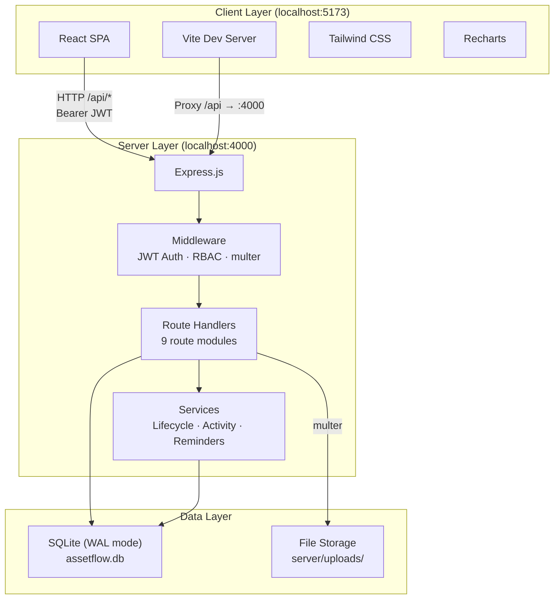

The architecture is a standard three-tier web application. The Vite development server proxies `/api` requests to the Express backend, eliminating CORS during development. In a production build, the React app would be served as static files from Express or a reverse proxy.

---

## Component Architecture

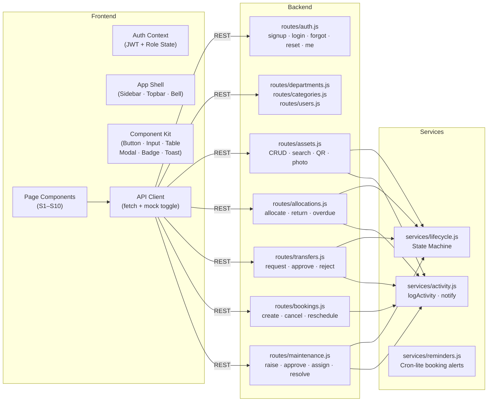

The backend is organized around **route modules** (one per domain entity) and **service modules** (cross-cutting concerns). Route modules handle HTTP-level concerns: request validation, response shaping, status codes. Services handle domain logic: the lifecycle state machine validates transitions, the activity service writes audit trails and notifications, and the reminder service polls for upcoming bookings.

---

## Folder Architecture

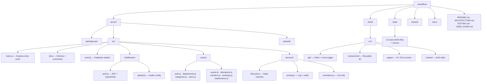

| Directory | Ownership | Purpose |
|---|---|---|
| `server/` | Backend engineer | Express app, SQLite schema, all business logic |
| `client/` | Frontend engineer | React SPA, page components, API client |
| `data/` | Data & QA lead | Seed data JSON files consumed by `seed.js` |
| `shared/` | Shared | Frozen API contract document |
| `docs/` | Data & QA lead | Validation reports, seed data documentation |

This folder ownership model was chosen to minimize merge conflicts: each team member works in their own directory, and merges to `main` happen at defined checkpoints.

---

## Backend Architecture

The Express server (`server/src/index.js`) follows a modular pattern:

```
index.js
├── Middleware stack: cors, express.json, static uploads
├── Health check: GET /api/health
├── Route mounts: 9 route modules under /api/*
├── 404 handler: unknown API routes
├── Central error handler: contract-shaped errors
└── Startup: listen on PORT, start reminders
```

**Request lifecycle:**

1. Express parses the request body (JSON) and serves static uploads.
2. The `requireAuth` middleware extracts and verifies the JWT from the `Authorization: Bearer <token>` header, loads the fresh user record from the database, and attaches it to `req.user`. Inactive accounts are rejected with HTTP 403.
3. Route-specific `requireRole(...)` guards check `req.user.role` against a whitelist.
4. The route handler validates the payload, executes business logic (calling services as needed), and returns a contract-shaped response: `{ ok: true, data }` on success, `{ ok: false, error: "..." }` on failure.
5. Any uncaught error falls through to the central error handler, which returns a contract-shaped error response with the appropriate HTTP status.

**Contract shape:** Every API response follows `{ ok: boolean, data?: any, error?: string }`. This gives the frontend a single, predictable response structure regardless of the endpoint.

---

## Frontend Architecture

The React SPA uses a standard pattern for role-based applications:

| Layer | Responsibility |
|---|---|
| **Auth Context** | Stores JWT in `localStorage`, tracks the current user's role, provides login/logout methods to the component tree |
| **App Shell** | Sidebar with role-filtered navigation links, topbar with notification bell, protected route wrapper that redirects unauthenticated users to login |
| **Pages** | One page component per PRD screen (S1–S10), each consuming the API client |
| **Component Kit** | Shared UI primitives: Button, Input, Select, Modal, Table, Badge (status-colored), Toast |
| **API Client** | Centralized `fetch` wrapper that attaches the JWT, handles errors, and supports a `USE_MOCK` flag for frontend-first development |

The `USE_MOCK` toggle in `api/index.js` allowed the frontend to develop against mock data shaped to the API contract before the backend was available. At merge checkpoints, `USE_MOCK` was set to `false` and the frontend connected to the live API.

---

## Database Architecture

The database is a single SQLite file (`server/assetflow.db`) initialized with WAL mode and foreign key enforcement:

```sql
PRAGMA journal_mode = WAL;
PRAGMA foreign_keys = ON;
```

### Entity-Relationship Diagram

```mermaid
erDiagram
    users ||--o{ allocations : "allocated_by"
    users ||--o{ allocations : "holder_user_id"
    users ||--o{ assets : "created_by"
    users ||--o{ transfer_requests : "requested_by"
    users ||--o{ transfer_requests : "decided_by"
    users ||--o{ bookings : "booked_by"
    users ||--o{ maintenance_requests : "raised_by"
    users ||--o{ maintenance_requests : "decided_by"
    users ||--o{ audit_cycles : "created_by"
    users ||--o{ audit_assignments : "auditor_user_id"
    users ||--o{ audit_items : "checked_by"
    users ||--o{ notifications : "user_id"
    users ||--o{ activity_logs : "user_id"
    users ||--o{ password_resets : "user_id"
    users }o--|| departments : "department_id"

    departments ||--o{ departments : "parent_id"
    departments ||--o| users : "head_user_id"
    departments ||--o{ allocations : "holder_department_id"
    departments ||--o{ transfer_requests : "to_department_id"
    departments ||--o{ audit_cycles : "scope_department_id"

    categories ||--o{ assets : "category_id"

    assets ||--o{ allocations : "asset_id"
    assets ||--o{ transfer_requests : "asset_id"
    assets ||--o{ bookings : "asset_id"
    assets ||--o{ maintenance_requests : "asset_id"
    assets ||--o{ audit_items : "asset_id"
    assets ||--o{ asset_history : "asset_id"

    allocations ||--o{ transfer_requests : "from_allocation_id"

    audit_cycles ||--o{ audit_assignments : "cycle_id"
    audit_cycles ||--o{ audit_items : "cycle_id"

    users {
        INTEGER id PK
        TEXT name
        TEXT email UK
        TEXT password_hash
        TEXT role "admin|asset_manager|dept_head|employee"
        INTEGER department_id FK
        TEXT status "active|inactive"
        TEXT created_at
    }

    departments {
        INTEGER id PK
        TEXT name
        INTEGER head_user_id FK
        INTEGER parent_id FK
        TEXT status "active|inactive"
    }

    categories {
        INTEGER id PK
        TEXT name
        TEXT description
        TEXT custom_fields "JSON array"
    }

    assets {
        INTEGER id PK
        TEXT tag UK "AF-NNNN"
        TEXT name
        INTEGER category_id FK
        TEXT serial_no
        TEXT acquisition_date
        REAL acquisition_cost
        TEXT condition "New|Good|Fair|Poor"
        TEXT location
        TEXT photo_url
        INTEGER is_bookable
        TEXT status "7 lifecycle states"
        TEXT custom_values "JSON object"
        INTEGER created_by FK
    }

    asset_history {
        INTEGER id PK
        INTEGER asset_id FK
        TEXT from_state
        TEXT to_state
        INTEGER actor_id FK
        TEXT detail
        TEXT created_at
    }

    allocations {
        INTEGER id PK
        INTEGER asset_id FK
        INTEGER holder_user_id FK
        INTEGER holder_department_id FK
        INTEGER allocated_by FK
        TEXT allocated_at
        TEXT expected_return_date
        TEXT returned_at
        TEXT return_condition_notes
        TEXT status "active|returned"
    }

    transfer_requests {
        INTEGER id PK
        INTEGER asset_id FK
        INTEGER from_allocation_id FK
        INTEGER requested_by FK
        INTEGER to_user_id FK
        INTEGER to_department_id FK
        TEXT status "requested|approved|rejected"
        INTEGER decided_by FK
        TEXT decided_at
        TEXT created_at
    }

    bookings {
        INTEGER id PK
        INTEGER asset_id FK
        INTEGER booked_by FK
        TEXT start_time
        TEXT end_time
        TEXT purpose
        TEXT status "booked|cancelled"
        TEXT created_at
    }

    maintenance_requests {
        INTEGER id PK
        INTEGER asset_id FK
        INTEGER raised_by FK
        TEXT issue
        TEXT priority "Low|Medium|High"
        TEXT photo_url
        TEXT status "pending|approved|rejected|assigned|in_progress|resolved"
        TEXT technician_name
        TEXT technician_contact
        INTEGER decided_by FK
        TEXT resolved_at
        TEXT created_at
    }

    audit_cycles {
        INTEGER id PK
        TEXT name
        INTEGER scope_department_id FK
        TEXT scope_location
        TEXT start_date
        TEXT end_date
        TEXT status "open|closed"
        INTEGER created_by FK
    }

    audit_assignments {
        INTEGER id PK
        INTEGER cycle_id FK
        INTEGER auditor_user_id FK
    }

    audit_items {
        INTEGER id PK
        INTEGER cycle_id FK
        INTEGER asset_id FK
        TEXT result "pending|verified|missing|damaged"
        TEXT note
        INTEGER checked_by FK
        TEXT checked_at
    }

    notifications {
        INTEGER id PK
        INTEGER user_id FK
        TEXT type
        TEXT title
        TEXT body
        TEXT entity_ref
        INTEGER is_read
        TEXT created_at
    }

    activity_logs {
        INTEGER id PK
        INTEGER user_id FK
        TEXT action
        TEXT entity_type
        INTEGER entity_id
        TEXT detail "JSON"
        TEXT created_at
    }

    password_resets {
        INTEGER id PK
        INTEGER user_id FK
        TEXT token
        TEXT expires_at
        INTEGER used
    }
```

### Schema Design Decisions

| Decision | Rationale |
|---|---|
| **15 tables** (14 from PRD §6 + `asset_history`) | `asset_history` was added beyond the PRD spec to support the lifecycle timeline view on the asset detail page. Every transition recorded by `transitionAsset()` writes here. |
| **CHECK constraints on enums** | Role, status, condition, priority, and result values are enforced at the database level, preventing invalid state from ever being persisted regardless of application-level bugs. |
| **Allocations hold both `holder_user_id` and `holder_department_id`** | Supports both individual and department-level allocation in a single table. Exactly one is non-null per record. |
| **Booking statuses: `booked` and `cancelled` only** | `Upcoming`, `Ongoing`, and `Completed` are derived from time comparison at read time in `routes/bookings.js`. This avoids stale status data and eliminates the need for scheduled status-update jobs. |
| **`custom_fields` (JSON) on categories, `custom_values` (JSON) on assets** | Category definitions store field schemas (name, type, label, required). Asset records store the actual values. This provides flexible per-category fields without schema migration. |
| **WAL mode** | Write-Ahead Logging allows concurrent reads during writes, which is necessary when the booking reminder interval fires while a user request is being processed. |

---

## Authentication Architecture

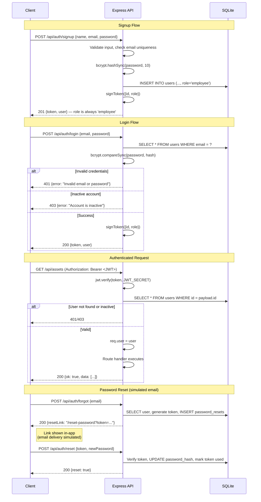

**Key decisions:**

- **JWT payload** contains `{ id, role }` only. The `requireAuth` middleware re-fetches the full user record from the database on every request, ensuring that role changes and account deactivations take immediate effect.
- **JWT expiry** is set to 7 days (`JWT_EXPIRES = '7d'`). Token refresh is not implemented — for a hackathon demo, session length is not a concern.
- **Signup always assigns `role: 'employee'`.** There is no role field in the signup payload. Role promotion happens exclusively through `PUT /api/users/:id` by an Admin.
- **Password reset** generates a `crypto.randomBytes(24)` token stored in `password_resets` with a 1-hour expiry. The reset link is returned in the API response and displayed in the UI. Real email delivery is an explicit non-goal (PRD §7).

---

## Authorization Architecture

Authorization is enforced at two levels: middleware-level role checks and route-level business logic.

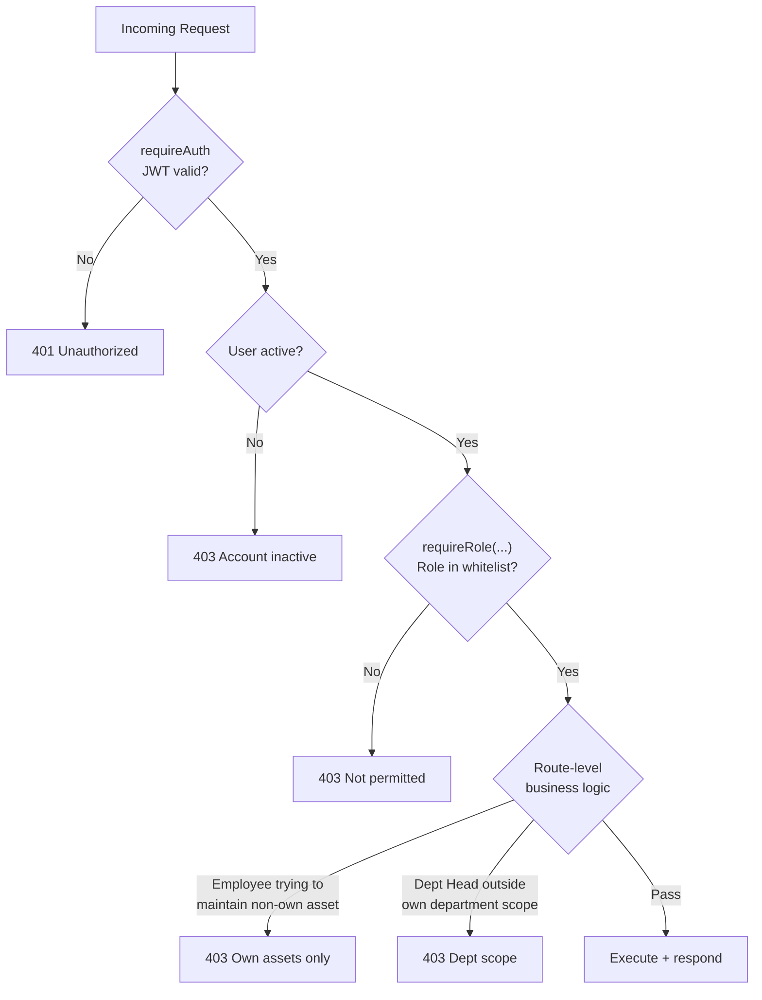

### Permission Enforcement by Route

| Route | Middleware Guard | Business Logic Guard |
|---|---|---|
| `POST /assets` | `requireRole('asset_manager')` | — |
| `POST /allocations` | `requireRole('asset_manager', 'dept_head')` | — |
| `POST /allocations/:id/return` | `requireRole('asset_manager', 'dept_head')` | — |
| `PUT /transfers/:id` | `requireRole('asset_manager', 'dept_head')` | — |
| `POST /maintenance` | `requireAuth` (all roles) | Employee: must hold the asset |
| `PUT /maintenance/:id` | `requireRole('asset_manager')` | — |
| `POST /bookings` | `requireAuth` (all roles) | Asset must be bookable |
| `PUT /bookings/:id` | `requireAuth` (all roles) | Must own the booking (or be admin/manager) |
| `PUT /users/:id` | `requireRole('admin')` | — |
| `POST/PUT /departments` | `requireRole('admin')` | — |
| `POST/PUT /categories` | `requireRole('admin')` | — |

---

## Asset Lifecycle Architecture

The lifecycle state machine is the central invariant of the system. It is implemented as a single function `transitionAsset(assetId, toState, actorId, detail)` in `services/lifecycle.js`.

### State Machine

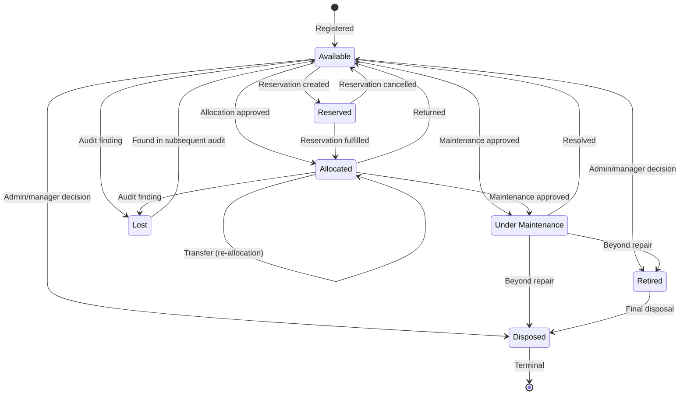

### Transition Map (from code)

The transition map is defined as a constant in `services/lifecycle.js`:

```javascript
const TRANSITIONS = {
  'Available':         ['Allocated', 'Reserved', 'Under Maintenance', 'Retired', 'Disposed', 'Lost'],
  'Allocated':         ['Available', 'Allocated', 'Under Maintenance', 'Lost'],
  'Reserved':          ['Allocated', 'Available'],
  'Under Maintenance': ['Available', 'Retired', 'Disposed'],
  'Lost':              ['Available'],
  'Retired':           ['Disposed'],
  'Disposed':          [], // terminal
};
```

Every call to `transitionAsset()`:

1. Validates the requested transition against the map. Illegal transitions throw a `TransitionError` (HTTP 400).
2. Updates the asset's `status` column.
3. Inserts a record into `asset_history` with `from_state`, `to_state`, `actor_id`, and `detail`.
4. Calls `logActivity()` to write to the global activity log.

The `Allocated → Allocated` self-transition is a special case: it represents a transfer where the asset remains allocated but the holder changes. The lifecycle service permits this explicitly.

---

## Allocation & Transfer Architecture

### Allocation Workflow

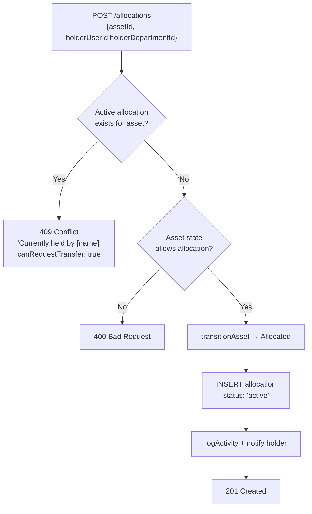

### Transfer Workflow

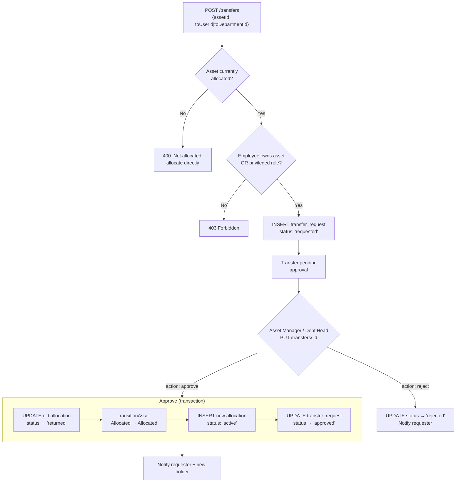

The transfer approval runs inside a SQLite transaction (`db.transaction()`). If any step fails — including the lifecycle transition — the entire operation rolls back.

---

## Booking Workflow Architecture

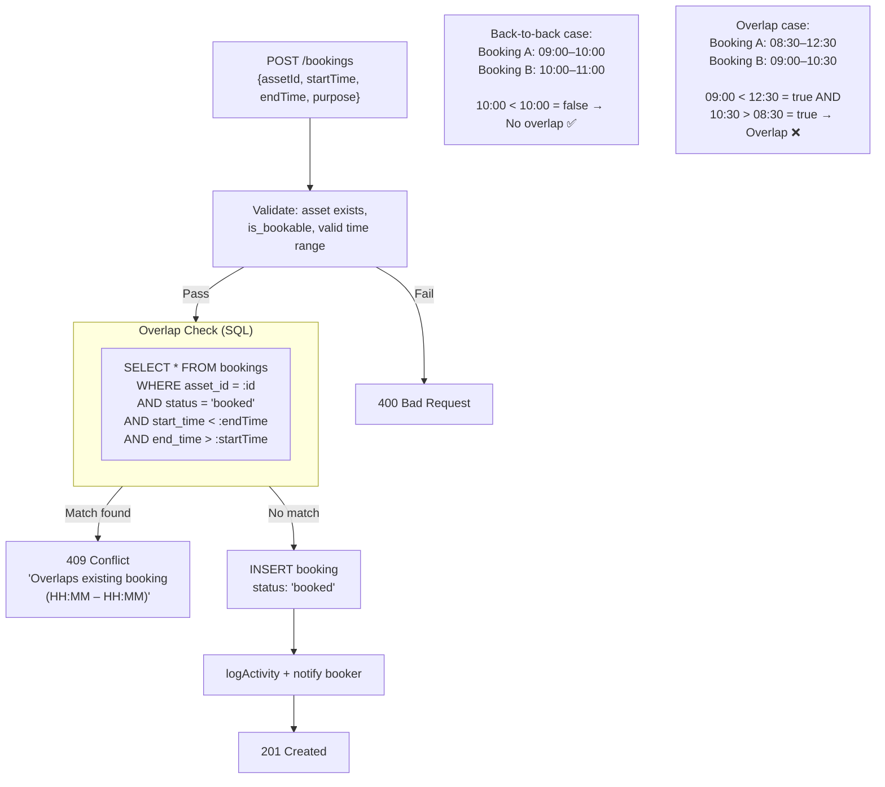

### Derived Booking Statuses

The database stores only two booking statuses: `booked` and `cancelled`. Display statuses are computed at read time in `routes/bookings.js`:

```javascript
function derivedStatus(b, now = new Date()) {
  if (b.status === 'cancelled') return 'Cancelled';
  const start = new Date(b.start_time);
  const end   = new Date(b.end_time);
  if (now < start) return 'Upcoming';
  if (now >= start && now <= end) return 'Ongoing';
  return 'Completed';
}
```

This eliminates the need for scheduled jobs to transition booking statuses over time.

### Rescheduling

`PUT /bookings/:id` with new `startTime` and `endTime` re-runs the overlap check (excluding the booking's own ID to avoid self-conflict) before updating the record.

### Booking Reminders

A `setInterval` loop in `services/reminders.js` runs every 60 seconds, scanning for bookings starting within the next 30 minutes. It generates a `booking_reminder` notification for each, using the notification's `entity_ref` field (`reminder:booking:<id>`) as an idempotency key to prevent duplicate reminders.

---

## Maintenance Workflow Architecture

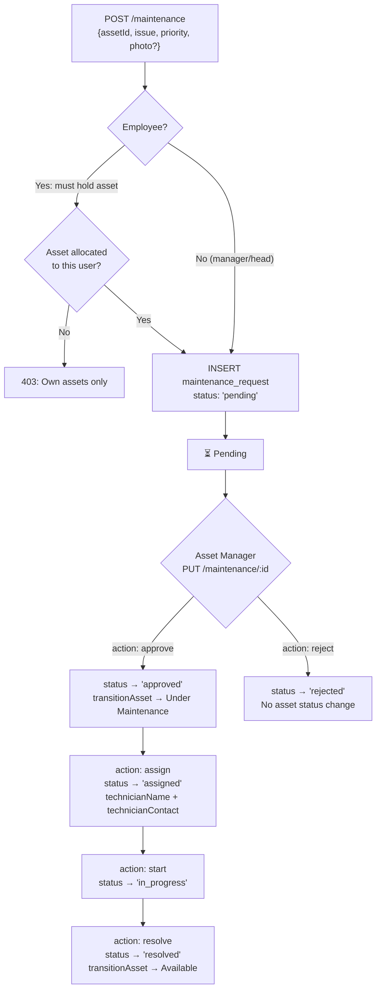

**Asset status side-effects** are enforced in the route handler:

| Action | Asset Status Change |
|---|---|
| `approve` | Current status → **Under Maintenance** |
| `reject` | No change |
| `assign` | No change |
| `start` | No change |
| `resolve` | Under Maintenance → **Available** |

The maintenance workflow has a linear progression: `pending → approved → assigned → in_progress → resolved`. The `reject` action is a branch from `pending` that terminates the request. Technician information is free-text (name + contact); technicians do not have system accounts (PRD §7).

### Valid Status Transitions

```javascript
const ACTIONS = {
  approve: { from: ['pending'],                      to: 'approved' },
  reject:  { from: ['pending'],                      to: 'rejected' },
  assign:  { from: ['approved', 'assigned'],         to: 'assigned' },
  start:   { from: ['assigned'],                     to: 'in_progress' },
  resolve: { from: ['in_progress', 'assigned', 'approved'], to: 'resolved' },
};
```

---

## Audit Workflow Architecture

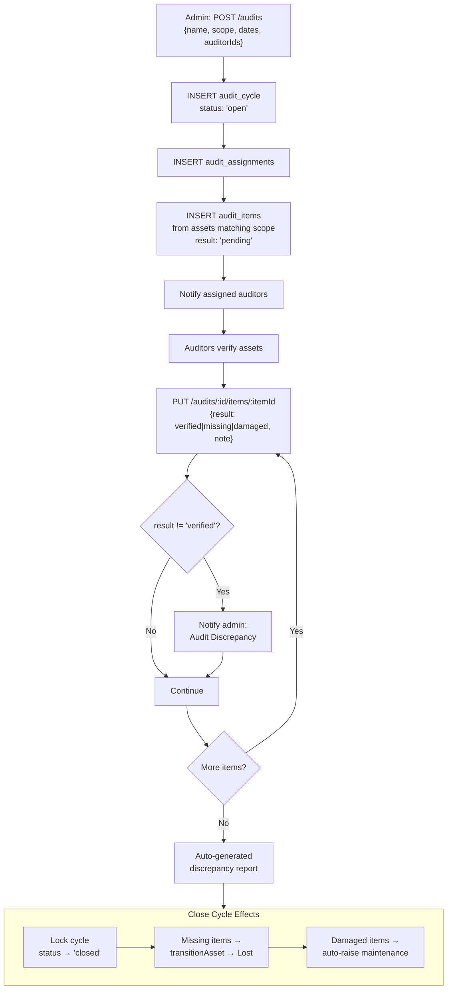

**Scope resolution:** When an audit cycle is created with `scope_location` and/or `scope_department_id`, the system queries assets matching those criteria and auto-populates `audit_items` with `result: 'pending'` for each.

**Close-cycle consequences:**

| Audit Result | Asset Status Change | Additional Effect |
|---|---|---|
| `verified` | None | — |
| `missing` | → **Lost** | — |
| `damaged` | None (asset stays current status) | Optionally auto-raises a maintenance request |
| `pending` | None | Unresolved items remain for record |

> [!NOTE]
> The PRD specifies "Damaged → optionally auto-raise maintenance request." The implementation treats this as an automatic system behavior (not a per-item user choice), consistent with Design Note DN-01 in the Validation Report.

---

## Notification Architecture

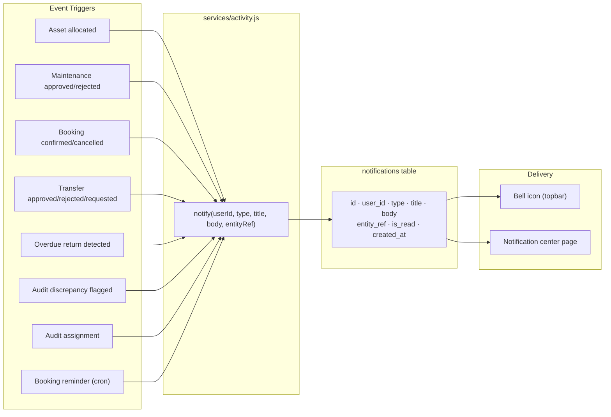

### Notification Type Mapping

| Event | Notification Type | Recipient |
|---|---|---|
| Asset allocated/re-allocated | `asset_assigned` | Holder |
| Maintenance approved | `maintenance_approved` | Requester |
| Maintenance rejected | `maintenance_rejected` | Requester |
| Maintenance resolved | `maintenance_resolved` | Requester |
| Booking confirmed | `booking_confirmed` | Booker |
| Booking cancelled | `booking_cancelled` | Booker |
| Booking starting soon | `booking_reminder` | Booker |
| Transfer approved | `transfer_approved` | Requester + previous holder |
| Transfer rejected | `transfer_rejected` | Requester |
| Transfer requested | `transfer_requested` | Current holder |
| Overdue return | `overdue_return` | Holder + Asset Manager |
| Audit discrepancy | `audit_discrepancy` | Admin |
| Audit assignment | `audit_assigned` | Assigned auditor |

**Idempotency:** Overdue alerts and booking reminders use `entity_ref` as a deduplication key. Before inserting, the system checks for an existing notification with the same `entity_ref`. This prevents duplicate notifications on repeated cron scans or API calls.

**Delivery:** All notifications are delivered in-app (stored in the database, retrieved via `GET /api/notifications`). Real email/SMS delivery is an explicit non-goal (PRD §7). The bell icon shows unread count; the notification center page shows all notifications with read/unread toggling.

---

## Activity Logging Architecture

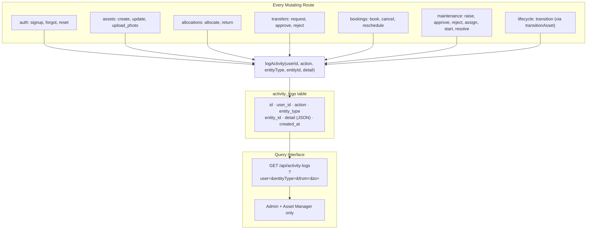

The `logActivity()` function accepts a free-form `detail` parameter (string or object). Objects are serialized as JSON. This provides structured context for each action without imposing a fixed schema on the detail field.

**Query ordering:** Activity logs are queried with `ORDER BY created_at`, not `ORDER BY id`. The append-only nature of the log means IDs are monotonically increasing during normal operation, but the seed data contains appended entries (IDs 67–69) with earlier timestamps. `ORDER BY created_at` ensures correct chronological display.

---

## Data Flow

A representative data flow for the allocation-with-conflict-and-transfer scenario:

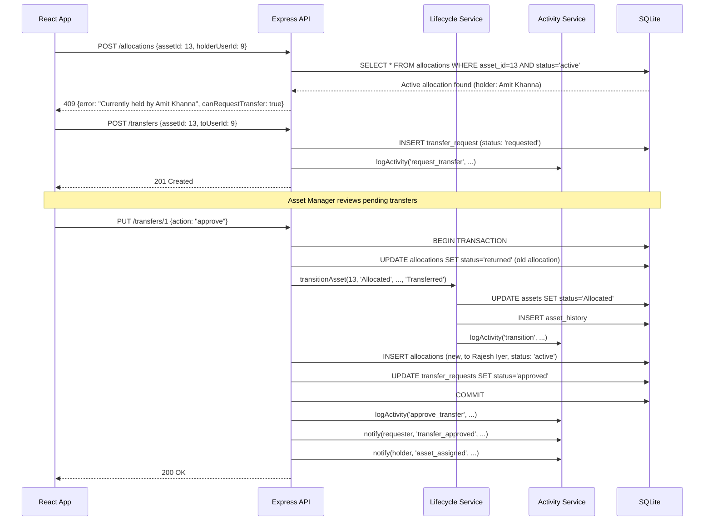

---

## Security Architecture

### Implemented Security Controls

| Layer | Control | Implementation |
|---|---|---|
| **Authentication** | Password hashing | bcrypt with 10 salt rounds |
| **Authentication** | Stateless sessions | JWT with 7-day expiry |
| **Authentication** | Password reset | Cryptographic token, 1-hour expiry, single-use |
| **Authorization** | Role-based access | `requireRole(...)` middleware on every protected route |
| **Authorization** | Ownership checks | Business logic in routes (e.g., employee can only maintain own assets) |
| **Data integrity** | Foreign key constraints | `PRAGMA foreign_keys = ON` |
| **Data integrity** | Enum constraints | `CHECK` constraints on all status/role/condition columns |
| **Data integrity** | Lifecycle enforcement | `transitionAsset()` validates against transition map |
| **Input validation** | Payload validation | Every mutating route validates required fields, types, and ranges |
| **Upload security** | File size limit | multer `limits.fileSize = 8MB` |
| **Error handling** | Information leakage prevention | Central error handler returns contract-shaped errors; password reset does not reveal email existence |

### Intentional Scope Boundaries

| Control | Status | Rationale |
|---|---|---|
| Rate limiting | Not implemented | Low risk for single-server demo |
| CSRF protection | Not implemented | JWT-based auth (no cookies) mitigates CSRF for API calls |
| HTTP security headers | Not implemented | Would add Helmet.js in production |
| HTTPS | Not implemented | Demo runs on localhost |
| JWT secret externalization | Hardcoded default | Would use `dotenv` in production |
| Content-type validation on uploads | Not implemented | multer handles basic file filtering |

---

## Error Handling Strategy

All errors follow a consistent contract-shaped response:

```json
{ "ok": false, "error": "Human-readable error message" }
```

| HTTP Status | Meaning | Example Trigger |
|---|---|---|
| 400 | Bad request / validation failure | Missing required field, invalid transition, invalid enum value |
| 401 | Authentication required | Missing or invalid JWT |
| 403 | Forbidden | Role not authorized, account inactive, ownership violation |
| 404 | Not found | Asset/allocation/booking ID does not exist |
| 409 | Conflict | Double-allocation attempt, booking overlap |
| 500 | Internal server error | Unhandled exception (caught by central error handler) |

The central error handler in `index.js` catches any error that propagates past route handlers:

```javascript
app.use((err, req, res, next) => {
  console.error(err);
  res.status(err.status || 500).json({ ok: false, error: err.message || 'Internal server error' });
});
```

The `TransitionError` class in `services/lifecycle.js` carries a `status: 400` property, so invalid lifecycle transitions produce 400 responses through this mechanism.

---

## Deployment Architecture

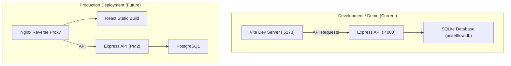

**Current state:** The application runs as two development processes — Vite dev server for the frontend and Node.js for the backend. The database is a single SQLite file. This is appropriate for the hackathon demo and local development.

**Production path:** A production deployment would replace Vite with the built static output (`npm run build`), add a reverse proxy (Nginx) for TLS termination and static serving, run the Express app under a process manager (PM2), and migrate from SQLite to PostgreSQL for multi-process write support and proper backup tooling.

---

## Scalability Considerations

AssetFlow is designed for single-server, low-concurrency deployment. The following documents the known scaling boundaries and the architectural changes needed to address them.

| Concern | Current State | Production Mitigation |
|---|---|---|
| **Database writes** | SQLite single-writer lock | Migrate to PostgreSQL |
| **Concurrent reads** | WAL mode supports parallel reads | PostgreSQL connection pooling |
| **Booking overlap check** | Single query per booking creation | Add index on `bookings(asset_id, status, start_time, end_time)` |
| **File uploads** | Local filesystem (`server/uploads/`) | Object storage (S3, GCS) |
| **Booking reminders** | `setInterval` in-process | Dedicated worker process or scheduled job system |
| **Notification delivery** | Database polling | WebSocket push or server-sent events |
| **Session validation** | Full user re-fetch per request | Redis-cached user records with TTL |
| **Multi-process** | Single Node.js process | PM2 cluster mode + shared database |

These are documented constraints, not defects. For the target deployment (hackathon demo with <10 concurrent users), the current architecture is appropriate.

---

## Architectural Trade-offs

| Decision | Benefit | Cost | Why It Was Chosen |
|---|---|---|---|
| SQLite over PostgreSQL | Zero-install, file-portable, survives machine swap | Single-writer, no multi-process writes, limited tooling | 10-hour hackathon: eliminating database setup time was worth the scaling limitation |
| Synchronous better-sqlite3 over async alternatives | Simpler control flow, no callback/promise complexity in route handlers | Blocks the event loop during queries | Query execution time is negligible at demo data volume (35 assets, 18 users) |
| `setInterval` reminders over a real job queue | No additional infrastructure (Redis, Bull, etc.) | Runs in the same process, no persistence across restarts | Adequate for demonstrating the booking reminder feature |
| Hardcoded JWT secret | No `.env` setup needed for demo | Security risk in production | Explicitly documented as a scope boundary, not an oversight |
| Derived booking statuses over persisted | No stale status data, no scheduled update jobs | Slight compute overhead on every read | The overlap check query already runs per booking; deriving status adds negligible cost |
| JSON columns for custom fields | Flexible per-category field definitions without schema migration | No SQL-level querying of custom field values | Custom fields are rendered in the UI; they are not used in business logic queries |

---

### Design Notes

**DN-ARCH-01:** The ER diagram shows 15 tables. The PRD §6 defines 14 entities. The additional table is `asset_history`, which was introduced to support the lifecycle timeline view on the asset detail page. Every call to `transitionAsset()` writes a record here.

**DN-ARCH-02:** The `password_resets` table includes a `used` column not specified in the PRD §6 entity definition. This was added to prevent token reuse — a standard security practice for password reset flows.

**DN-ARCH-03:** The booking overlap SQL uses `datetime()` SQLite functions for comparison. This works correctly with ISO 8601 timestamp strings because SQLite's `datetime()` function parses them consistently. The seed data stores all timestamps in `YYYY-MM-DDTHH:mm:ss.000Z` format to ensure compatibility.
