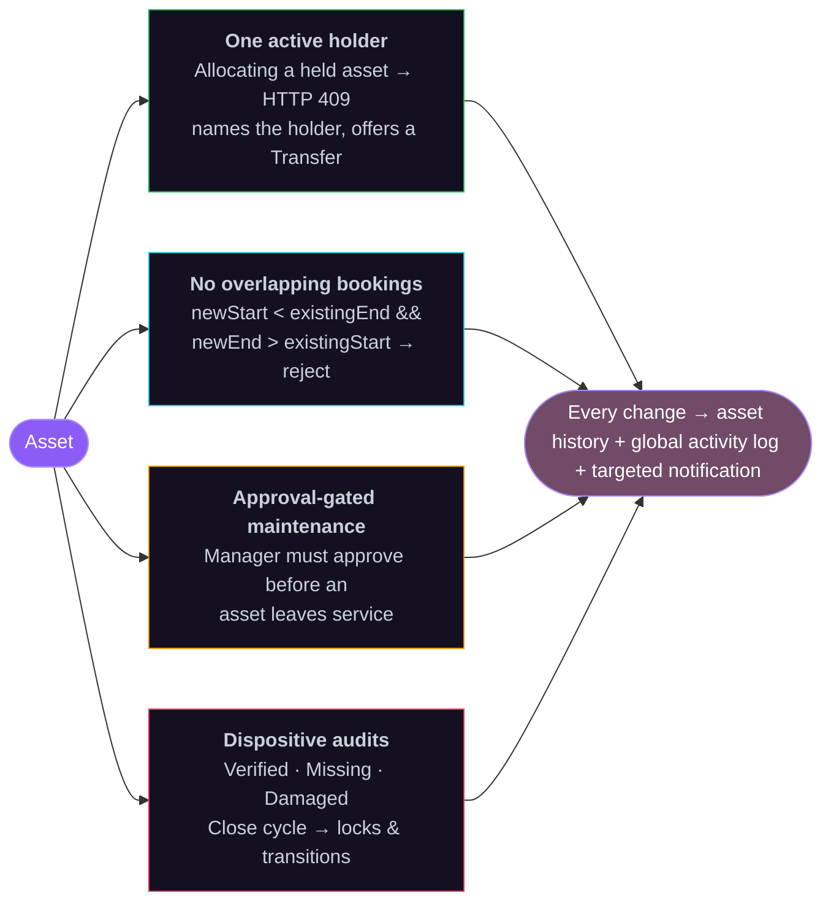
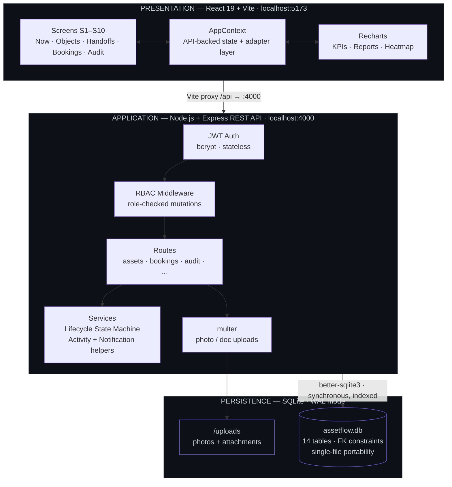
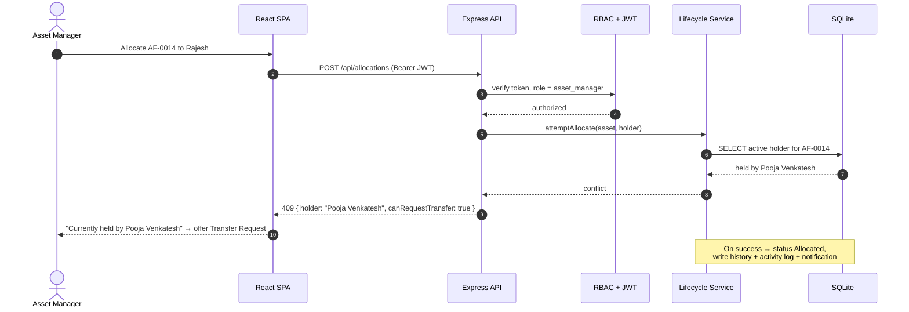
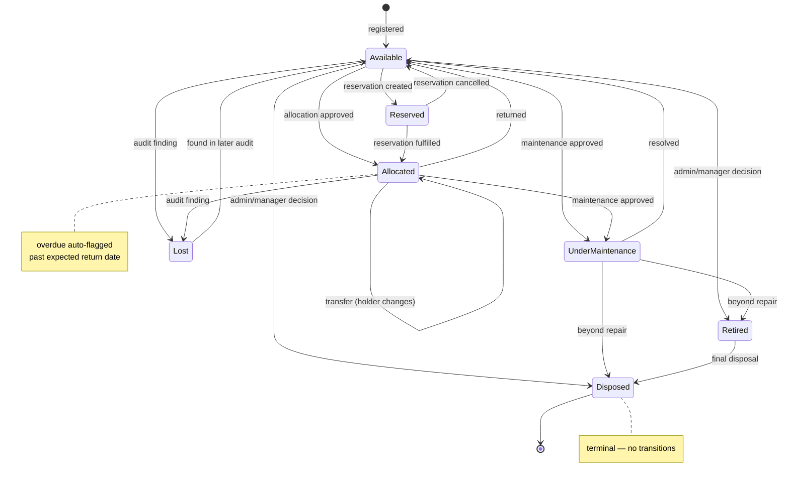
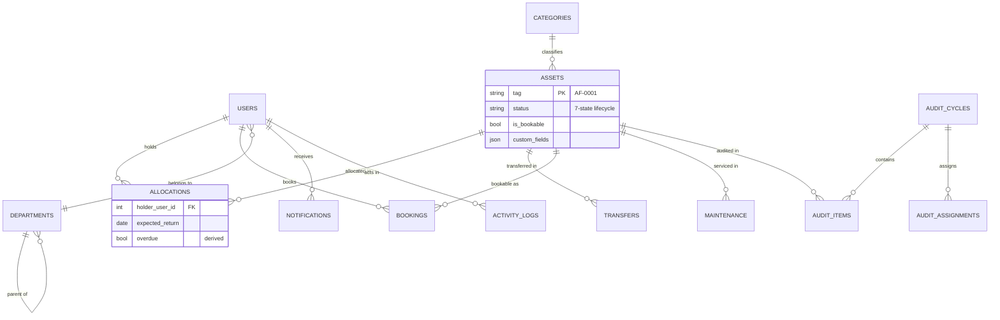

<div align="center">
<br />

<h1>AssetFlow</h1>

<p><strong>Enterprise Asset &amp; Resource Management</strong></p>

<p>
<em>Track, allocate, maintain, and audit every physical asset —<br />
from laptops and conference rooms to vehicles and networking equipment —<br />
through one system that enforces conflict-free reality at the server, not by convention.</em>
</p>

<br />

<a href="https://assetflow-frontend-lemon.vercel.app/"></a>
&nbsp;
<a href="https://youtu.be/B7d6BHgcjYs?si=C3cmcKVMxFAr2u0g"></a>

<br /><br />


<br />
</div>

---

<div align="center">
<table>
<tr>
<td align="center" width="50%">
<strong>Live deployment</strong><br />
<a href="https://assetflow-frontend-lemon.vercel.app/">assetflow-frontend-lemon.vercel.app</a><br />
<sub>Sign in as <code>admin@assetflow.app</code> / <code>Admin@123</code></sub>
</td>
<td align="center" width="50%">
<strong>Video walkthrough</strong><br />
<a href="https://youtu.be/B7d6BHgcjYs?si=C3cmcKVMxFAr2u0g">youtu.be/B7d6BHgcjYs</a><br />
<sub>Full product tour, end to end</sub>
</td>
</tr>
</table>
</div>

---

## Contents

<table>
<tr>
<td valign="top">

**Overview**
- [The Problem](#the-problem)
- [The Solution](#the-solution)
- [Key Features](#key-features)
- [Architecture Overview](#architecture-overview)
- [Request Lifecycle](#request-lifecycle)
- [Asset Lifecycle](#asset-lifecycle)

</td>
<td valign="top">

**Reference**
- [Technology Stack](#technology-stack)
- [Data Model](#data-model)
- [Project Structure](#project-structure)
- [Core Workflows](#core-workflows)
- [Reports &amp; Analytics](#reports--analytics)
- [Notifications &amp; Activity Log](#notifications--activity-log)

</td>
<td valign="top">

**Operations**
- [Getting Started](#getting-started)
- [Environment &amp; Configuration](#environment--configuration)
- [Seed Data](#seed-data)
- [Login Credentials](#login-credentials)
- [Roles &amp; Permissions](#user-roles--permissions)
- [Security](#security) · [Performance](#performance)
- [Roadmap](#roadmap) · [Contributors](#contributors)

</td>
</tr>
</table>

<br />

## The Problem

Organizations still track physical assets — laptops, monitors, servers, vehicles, conference rooms — across disconnected spreadsheets, email threads, and paper logs. This creates concrete, recurring failures:

| Failure | What actually happens |
| :-- | :-- |
| **Double-allocation** | Two people believe they hold the same laptop. Neither discovers the conflict until one of them needs it. |
| **Booking collisions** | A conference room is double-booked for overlapping time slots. Both parties show up. |
| **Invisible maintenance** | A printer is sent for repair, but the registry still shows it as *Available*. Someone allocates it to a new hire. |
| **Audit blindness** | No one can answer *"where is the Cisco switch that was in Rack B7?"* without walking the floor. |
| **No lifecycle trail** | When an asset breaks, there is no record of who held it, its condition, or whether it was ever maintained. |

These are not hypothetical — they are the daily reality of asset management without **structured lifecycle enforcement**.

<br />

## The Solution

AssetFlow replaces those disconnected tools with a single system built around **four invariants**, each enforced **server-side**.



1. **An asset can have exactly one active holder.** Attempting to allocate an already-held asset is blocked at the server level with a message naming the current holder, and a Transfer Request is offered instead.
2. **A bookable resource cannot have overlapping time slots.** The overlap check (`newStart < existingEnd && newEnd > existingStart`) runs server-side on every booking. Back-to-back bookings — where one ends at the exact time another begins — are correctly accepted.
3. **Maintenance requires approval before an asset leaves service.** A request must be approved by an Asset Manager before the asset's status changes to *Under Maintenance*, preventing premature unavailability.
4. **Audit cycles produce accountable, dispositive results.** An auditor marks each in-scope asset as Verified, Missing, or Damaged. Closing a cycle locks it, transitions confirmed-missing assets to Lost, and optionally auto-raises maintenance for damaged assets.

<br />

## Key Features

| Screen | Feature | What it does |
| :--: | :-- | :-- |
| **S1** | **Login / Signup** | Email + password authentication. Signup creates an Employee-only account — no role self-selection. Admin promotes roles from the Employee Directory. Forgot-password flow with in-app reset link (email delivery simulated). |
| **S2** | **Dashboard** | Six KPI cards (Available, Allocated, Maintenance Today, Active Bookings, Pending Transfers, Upcoming Returns). Overdue returns highlighted in red, separate from upcoming. Quick actions filtered by role. Recent-notifications panel. |
| **S3** | **Organization Setup** | Admin-only, three tabs: Departments (with hierarchy), Asset Categories (custom field definitions stored as JSON), Employee Directory — the sole surface for role and department assignment. |
| **S4** | **Asset Registration &amp; Directory** | Register with auto-generated tags (`AF-0001`, `AF-0002`…), serials, custom fields, condition, location, bookable flag. Directory with search and filters by category/status/department/location, QR per asset. Detail page with lifecycle timeline, allocation and maintenance history. |
| **S5** | **Allocation &amp; Transfer** | Allocate to employee or department with optional Expected Return Date. Conflict rule: allocating a held asset returns HTTP 409 with the holder's name and a `canRequestTransfer` flag. Transfer: Requested → Approved/Rejected → Re-allocated. Return flow with condition check-in notes. Overdue auto-flagged. |
| **S6** | **Resource Booking** | Only bookable-flagged assets appear. Week-grid calendar. Server-side overlap rejection. Statuses Upcoming/Ongoing/Completed derived at read time; Cancelled persisted. Cancel and reschedule own bookings. |
| **S7** | **Maintenance Management** | Raise with issue description, priority (Low/Medium/High), optional photo. Workflow: Pending → Approved/Rejected → Technician Assigned → In Progress → Resolved. Technician is free-text (no login). Approval → *Under Maintenance*; resolution → *Available*. Kanban board by status. |
| **S8** | **Asset Audit** | Admin creates Audit Cycles with scope (department and/or location), date range, and assigned auditors. Auditors mark each asset Verified / Missing / Damaged with notes. Auto-generated discrepancy report. Close cycle → locks it, applies transitions (Missing → Lost; Damaged → optionally auto-raise maintenance). |
| **S9** | **Reports &amp; Analytics** | Asset utilization (most-allocated vs. idle), maintenance frequency by category, assets due for return / flagged for retirement, department-wise allocation summary, booking heatmap (day × hour grid). CSV export on every report. |
| **S10** | **Activity Logs &amp; Notifications** | Notification center: Asset Assigned, Maintenance Approved/Rejected, Booking Confirmed/Cancelled/Reminder, Transfer Approved/Rejected, Overdue Return Alert, Audit Discrepancy Flagged. Mark read/unread. Activity Log for admins and managers, filterable by user, entity type, and date. |

<br />

## Architecture Overview

A clean three-tier separation: a React SPA talks to a stateless Express API over JWT-authenticated REST, which persists to a single-file SQLite database in WAL mode.



For full entity-relationship diagrams, state machine diagrams, and architectural decision rationale, see [ARCHITECTURE.md](ARCHITECTURE.md).

**Why an adapter layer?** The screens were originally built against a mock, localStorage-seeded dataset with its own shape (lowercase statuses like `"allocated"`, `tag` as the primary key, `heldBy` as a holder id, capitalized roles like `"Admin"`/`"Manager"`/`"Employee"`). The real backend uses a different shape — capitalized status enums, numeric ids, `holder_user_id`, roles like `admin`/`asset_manager`/`dept_head`/`employee`. Rather than rewrite every screen, `src/context/AppContext.jsx` fetches from the real API and maps responses into the exact shape the screens expect, so the components stay untouched while every read and write is real.

<br />

## Request Lifecycle

The allocation-conflict path in full — from click to HTTP 409.



<br />

## Asset Lifecycle

Assets move through **seven states**. Every transition writes an entry to the asset's history and the global activity log.

**States:** `Available` · `Allocated` · `Reserved` · `Under Maintenance` · `Lost` · `Retired` · `Disposed`



<details>
<summary><strong>Full transition table</strong></summary>

| From | To | Trigger |
| :-- | :-- | :-- |
| Available | Allocated | Allocation approved |
| Available | Reserved | Reservation created |
| Available | Under Maintenance | Maintenance request approved |
| Available | Retired | Admin/manager decision |
| Available | Disposed | Admin/manager decision |
| Available | Lost | Audit finding |
| Allocated | Available | Asset returned |
| Allocated | Allocated | Transfer (history updated, holder changes) |
| Allocated | Under Maintenance | Maintenance request approved |
| Allocated | Lost | Audit finding |
| Reserved | Allocated | Reservation fulfilled |
| Reserved | Available | Reservation cancelled |
| Under Maintenance | Available | Maintenance resolved |
| Under Maintenance | Retired | Beyond repair |
| Under Maintenance | Disposed | Beyond repair |
| Lost | Available | Found during later audit |
| Retired | Disposed | Final disposal |
| Disposed | *(terminal)* | No further transitions |

</details>

<br />

## Technology Stack

| Layer | Technology | Purpose |
| :-- | :-- | :-- |
| Frontend | React 19 · Vite · Tailwind CSS | SPA with hot module replacement |
| Charts | Recharts | Dashboard KPIs and report visualizations |
| Backend | Node.js + Express | REST API server |
| Database | SQLite via better-sqlite3 | Zero-install, file-based persistence. WAL mode for concurrent reads. Synchronous — no callback overhead. |
| Authentication | JWT (jsonwebtoken + bcryptjs) | Stateless auth with role-based access control middleware |
| Calendar | Hand-rolled week grid (CSS Grid) | Resource booking display without an external calendar dependency |
| QR Codes | qrcode (npm) | Per-asset QR generation (scan input = typing/pasting the asset tag) |
| File Uploads | multer | Asset photos and maintenance attachments, served from `server/uploads/` |

**Ports:** API at `http://localhost:4000`, frontend at `http://localhost:5173` (Vite proxies `/api` and `/uploads` → port 4000).

<br />

## Data Model

Fourteen foreign-key-constrained tables. The core relationships:



<br />

## Documentation

| Document | Description |
| :-- | :-- |
| [Architecture](ARCHITECTURE.md) | System architecture, Mermaid diagrams, workflows |
| [Implementation Plan](IMPLEMENTATION.md) | Development roadmap |
| [Product Requirements](PRD.md) | Functional requirements |
| [API Contract](shared/API_CONTRACT.md) | Frozen API contract (routes, shapes, status codes) |
| [Seed Data Package](docs/SEED_DATA_PACKAGE.md) | Enterprise seed data narrative |
| [Seed Data Review](docs/SEED_DATA_REVIEW.md) | Engineering review |
| [Validation Report](docs/VALIDATION_REPORT.md) | Full enterprise QA audit |

<br />

## Project Structure

```
AssetFlow/
├── server/                          Backend — Express + better-sqlite3 API
│   ├── src/
│   │   ├── index.js                 Express app entry point
│   │   ├── db.js                    SQLite schema (idempotent, created on boot)
│   │   ├── seed.js                  Idempotent demo-data seeder (reads data/*.json)
│   │   ├── middleware/              JWT auth + RBAC, file upload
│   │   ├── routes/                  One file per resource (assets, auth, bookings, …)
│   │   └── services/                Lifecycle state machine, activity/notification helpers
│   ├── uploads/                     Uploaded photos/documents (gitignored)
│   └── .env.example                 Backend environment variables
│
├── data/                            Seed data package
│   ├── departments.json             7 departments (1 inactive)
│   ├── categories.json              7 asset categories with custom fields
│   ├── employees.json               18 users across all 4 roles
│   ├── assets.json                  35 assets across all lifecycle states
│   ├── allocations.json             32 allocation records
│   ├── transfers.json               4 transfer requests
│   ├── bookings.json                14 bookings (incl. back-to-back boundary case)
│   ├── maintenance.json             7 maintenance requests (all 6 states)
│   ├── audit_cycles.json            2 audit cycles
│   ├── audit_assignments.json       4 auditor assignments
│   ├── audit_items.json             21 audit items
│   ├── notifications.json           27 notifications
│   └── activity_logs.json           69 activity log entries
│
├── src/                             Frontend — React 19 + Vite
│   ├── api/client.js                Fetch wrapper + typed API resource helpers
│   ├── context/AppContext.jsx       API-backed app state (adapter layer)
│   ├── screens/                     One screen per nav view (Now, Objects, Handoffs, …)
│   ├── components/                  Shared UI (AppFrame, StampedTag, LifecycleRail, …)
│   └── db/mockData.js               Legacy mock dataset (reference/fallback only)
│
├── shared/API_CONTRACT.md           Frozen API contract
├── docs/                            Seed data package, review, validation report
└── .env.example                     Frontend environment variables
```

<br />

## Getting Started

**Prerequisites** — Node.js ≥ 18.x, npm ≥ 9.x. No external database is required; SQLite is embedded via better-sqlite3.

### 1 — Backend

```bash
git clone https://github.com/pranavpanchal1326/AssetFlow.git
cd AssetFlow/server

npm install
cp .env.example .env      # optional — a dev JWT secret is used if you skip this
npm run seed              # creates/resets assetflow.db with all demo data
npm run dev               # API → http://localhost:4000
```

### 2 — Frontend  *(separate terminal)*

```bash
cd AssetFlow              # repo root
npm install
cp .env.example .env      # optional — proxy mode works with no .env at all
npm run dev               # Vite → http://localhost:5173
```

Vite proxies `/api` and `/uploads` to `http://localhost:4000`, so the frontend just calls `fetch("/api/…")` with no CORS setup. To run the backend on a different host/port, set `VITE_API_URL` in `.env`. Open `http://localhost:5173`, choose **Enter App**, then **Sign in** — or skip setup and use the [live deployment](https://assetflow-frontend-lemon.vercel.app/).

### Quick verification

1. Log in as Admin: `admin@assetflow.app` / `Admin@123`.
2. The Dashboard shows KPI cards with pre-seeded counts. Two overdue returns (**AF-0019** and **AF-0017**) appear highlighted in red.
3. Navigate to Asset Directory — **35 assets** across **7 categories** are visible.

<br />

## Environment & Configuration

| Variable | Location | Default | Description |
| :-- | :-- | :-- | :-- |
| `PORT` | `server/.env` | `4000` | Express server port |
| `JWT_SECRET` | `server/.env` | dev fallback (warns) | Secret for signing JWTs — required in production |
| `DB_PATH` | `server/.env` | `server/assetflow.db` | SQLite database file path |
| `NODE_ENV` | `server/.env` | `development` | Runtime environment |
| `VITE_API_URL` | root `.env` | *(dev proxy)* | Override the backend URL; default uses the Vite proxy |

> **Note** — For the hackathon demo, sensible dev defaults apply with no `.env`. A production deployment externalizes `JWT_SECRET` and `DB_PATH`. This is an intentional scope simplification, not an oversight. Two `.env.example` files exist: the repo-root one controls the frontend (proxy vs. explicit `VITE_API_URL`); `server/.env.example` holds backend vars (`JWT_SECRET`, `PORT`, `DB_PATH`, `NODE_ENV`). Copy each to `.env` before running in a shared or production-like environment.

<br />

## Seed Data

The seed represents **NexGen Infra Solutions Pvt. Ltd.**, a fictional mid-size engineering consultancy with offices in Pune and Mumbai. The data spans **June 2025 → July 2026** (14 months) and demonstrates every requirement through realistic operational history rather than synthetic test cases. The seeder is **idempotent** — it clears all tables and re-inserts from `data/*.json` on each run.

| Entity | Count | Coverage |
| :-- | :--: | :-- |
| Departments | 7 | Hierarchy (Engineering → Platform Team, QA). One inactive (Design &amp; Surveying — merged). |
| Users | 18 | 1 admin, 2 asset managers, 5 dept heads, 10 employees. One offboarded. |
| Assets | 35 | Laptops, monitors, networking, rooms, vehicles, printers, mobile devices. All 7 states. 6 bookable. |
| Allocations | 32 | Active, returned, and overdue. Individual and department-level. |
| Transfers | 4 | Approved (2), rejected (1), pending (1). |
| Bookings | 14 | Completed, cancelled, ongoing, upcoming, plus the back-to-back boundary case. |
| Maintenance | 7 | All 6 workflow states (pending, approved, rejected, assigned, in_progress, resolved). |
| Audit Cycles | 2 | One closed (clean Q4 2025 Pune audit), one open (Q2 2026 Mumbai with missing + damaged). |
| Audit Items | 21 | Verified, missing, damaged, and pending results. |
| Notifications | 27 | All notification types. Mix of read/unread. |
| Activity Logs | 69 | Full operational trail with causal chain. |

### Hero assets (rich lifecycle narratives)

| Asset | Tag | Story |
| :-- | :-- | :-- |
| MacBook Pro 14" M3 | `AF-0014` | Allocated → returned → re-allocated → keyboard maintenance → resolved → re-allocated to Pooja Venkatesh |
| Dell UltraSharp Monitor | `AF-0003` | Allocated → screen flickering → panel replaced → re-allocated to Rajesh Iyer |
| HP LaserJet Pro | `AF-0008` | Department allocation → returned → Retired → **Disposed** (terminal state) |
| iPad Pro 12.9" | `AF-0019` | Allocated to Karthik Bhat → offboarding return → re-allocated to Farhan Sheikh → **overdue** (11 days past due) |
| Toyota Innova Crysta | `AF-0022` | Bookable vehicle with AC compressor maintenance history and multiple completed bookings |
| Cisco Switch | `AF-0025` | Allocated to Platform Team, Rack B7 → marked **Missing** in open audit → becomes Lost on cycle close |

<br />

## Login Credentials

All seeded users share the password `Password@123`, except the admin account (`Admin@123`).

| Role | Name | Email | Password |
| :-- | :-- | :-- | :-- |
| **Admin** | Arjun Mehta | `admin@assetflow.app` | `Admin@123` |
| **Asset Manager** | Deepak Nair | `deepak.nair@nexgeninfra.com` | `Password@123` |
| **Asset Manager** | Nandini Krishnan | `nandini.krishnan@nexgeninfra.com` | `Password@123` |
| **Dept Head** | Kavita Sharma | `kavita.sharma@nexgeninfra.com` | `Password@123` |
| **Dept Head** | Rohan Kulkarni | `rohan.kulkarni@nexgeninfra.com` | `Password@123` |
| **Dept Head** | Sneha Patil | `sneha.patil@nexgeninfra.com` | `Password@123` |
| **Dept Head** | Megha Joshi | `megha.joshi@nexgeninfra.com` | `Password@123` |
| **Dept Head** | Vikram Desai | `vikram.desai@nexgeninfra.com` | `Password@123` |
| **Employee** | Priya Deshmukh | `priya.deshmukh@nexgeninfra.com` | `Password@123` |
| **Employee** | Rajesh Iyer | `rajesh.iyer@nexgeninfra.com` | `Password@123` |

> **Tip** — To exercise the full RBAC surface, log in as one user per role — each sees a different sidebar and action set. The **Switch User (Demo)** dropdown performs a real login as the selected seeded account (a testing aid, not an impersonation endpoint).

<br />

## User Roles & Permissions

Roles are assigned exclusively by an Admin through the Employee Directory (Organization Setup → Tab C). Signup always creates an Employee — there is no role self-selection. RBAC is enforced **server-side**; the frontend surfaces a `403` as an in-app error banner.

| Capability | Admin | Asset Manager | Dept Head | Employee |
| :-- | :--: | :--: | :--: | :--: |
| Manage departments, categories, employee roles | ● | | | |
| Create / close audit cycles, assign auditors | ● | | | |
| Org-wide analytics | ● | ● | dept only | |
| Register assets | | ● | | |
| Allocate assets, approve transfers &amp; returns | | ● | dept scope | |
| Approve maintenance requests | | ● | | |
| Approve allocation/transfer within own dept | | ● | ● | |
| Book shared resources | ● | ● | ● (for dept) | ● |
| Raise maintenance request | ● | ● | ● | own assets |
| Initiate return/transfer request | | ● | ● | own assets |
| View own allocated assets | ● | ● | ● | ● |
| Act as auditor (when assigned to a cycle) | ● | ● | ● | ● |

<br />

## Core Workflows

<details open>
<summary><strong>Allocation &amp; Transfer</strong></summary>

1. An Asset Manager selects an Available asset and allocates it to an employee or department, optionally setting an Expected Return Date.
2. If the asset is already held, the server returns HTTP 409 with the current holder's name (e.g., *"Currently held by Priya Sharma"*) and offers a Transfer Request.
3. Transfers follow **Requested → Approved/Rejected** (by Asset Manager or Dept Head) **→ Re-allocated**, with automatic allocation-history update.
4. Returns are processed with condition check-in notes and Asset Manager approval; the asset transitions back to Available.
5. Allocations past their Expected Return Date are auto-flagged as overdue on the Dashboard and in Notifications.
</details>

<details>
<summary><strong>Resource Booking</strong></summary>

1. Only assets with `is_bookable: true` (conference rooms, vehicles, projectors) appear in the booking interface.
2. A user selects a resource, views its week-grid calendar, and creates a booking with start/end time and purpose.
3. The server validates against all non-cancelled bookings for that asset: `newStart < existingEnd && newEnd > existingStart` → reject with HTTP 409. Touching boundaries (one ends at 10:00, the next starts at 10:00) are accepted.
4. Statuses `Upcoming`, `Ongoing`, `Completed` are derived from time comparison at read time. Only `booked` and `cancelled` are persisted.
</details>

<details>
<summary><strong>Maintenance</strong></summary>

1. Any user raises a request on an asset they hold (employees: own assets only; Managers and Dept Heads: broader scope), specifying issue description and priority.
2. An Asset Manager approves or rejects. **Approval immediately transitions the asset to Under Maintenance.**
3. A technician is assigned (free-text name and contact — technicians do not have system accounts).
4. Work progresses through In Progress to Resolved. **Resolution transitions the asset back to Available.**
</details>

<details>
<summary><strong>Audit</strong></summary>

1. An Admin creates an Audit Cycle with a name, scope (department and/or location), date range, and assigned auditors.
2. The system auto-populates audit items from assets matching the scope.
3. Assigned auditors review each item and mark it **Verified**, **Missing**, or **Damaged** with notes.
4. A discrepancy report is auto-generated from all non-verified items.
5. Closing the cycle **locks it** and applies status updates: confirmed Missing → **Lost**; Damaged → optionally auto-raises a maintenance request.
</details>

<br />

## Reports & Analytics

| Report | Type | Description |
| :-- | :-- | :-- |
| Asset Utilization | Bar chart | Most-allocated vs. idle assets |
| Maintenance Frequency | Chart | Breakdown by asset category |
| Due for Return / Retirement | Table | Assets with upcoming or overdue return dates, and those flagged for retirement |
| Department Allocation Summary | Table + chart | Asset distribution across departments |
| Booking Heatmap | Day × hour grid | Booking density across time slots |

All reports support **CSV export**.

> **Note** — Analytics scope is role-dependent: Admins and Asset Managers see org-wide data. Dept Heads see their department only. Employees do not have access to Reports.

<br />

## Notifications & Activity Log

### Notification types

| Type | Trigger |
| :-- | :-- |
| Asset Assigned | Asset allocated or re-allocated to a user |
| Maintenance Approved / Rejected | Asset Manager decides on a maintenance request |
| Booking Confirmed / Cancelled / Reminder | Booking created, cancelled, or approaching start time |
| Transfer Requested | Current holder notified of an incoming transfer request |
| Transfer Approved / Rejected | Asset Manager or Dept Head decides on a transfer |
| Overdue Return Alert | Allocation past Expected Return Date (sent to holder and Asset Manager) |
| Audit Discrepancy Flagged | Audit item marked Missing or Damaged |
| Audit Assigned | User assigned as auditor for a cycle |

### Activity log

Every create, update, and state transition writes to the global activity log with **actor, action, entity type, entity ID, detail JSON, and timestamp**. Accessible to Admins and Asset Managers, filterable by user, entity type, and date range.

<br />

## Security

**Implemented**

- **Authentication** — Email + password with bcrypt hashing (10 salt rounds). JWT-based stateless sessions.
- **Authorization** — RBAC enforced at the middleware layer. Every mutating endpoint checks the caller's role against the permission table before execution.
- **Password reset** — Token-based flow. For the demo, the reset link is displayed in-app rather than emailed (real delivery is an explicit non-goal per PRD §7).
- **Input validation** — Payload validation on all mutating endpoints with descriptive 400-level error messages.
- **Foreign key constraints** — Enforced at the SQLite level (`PRAGMA foreign_keys = ON`).

**Not implemented (intentional scope boundaries)**

- Rate limiting, CSRF protection, and HTTP security headers were deprioritized for the hackathon build.
- The JWT secret uses a dev fallback rather than a mandatory externalized value.
- File-upload validation is limited to multer's built-in handling — no virus scanning or deep content-type verification.
- No HTTPS — the demo runs over plain HTTP on localhost.

> **Important** — These omissions are documented intentionally. They reflect the scope boundary between a 10-hour hackathon build and a production deployment, not gaps in awareness.

<br />

## Performance

No formal load testing has been performed. The following are architectural characteristics, not measured benchmarks:

- **SQLite with WAL mode** supports concurrent reads without blocking — appropriate for a single-server demo with low concurrent user counts.
- **better-sqlite3** uses synchronous operations, avoiding the callback overhead of async bindings. At the demo's volume (35 assets, 18 users), query latency is negligible.
- **Vite's dev server** provides sub-second hot module replacement.
- The booking overlap check runs a single indexed query per creation — effectively constant-time at the seeded volume.

A production deployment would require benchmarking under realistic concurrency, indexing beyond primary keys, and potentially migrating to PostgreSQL for multi-process write support.

<br />

## Roadmap

- **Real email/SMS notifications** — replace in-app simulated delivery with SMTP/SMS integration
- **Mobile-responsive PWA** — optimize for tablet and phone during floor audits
- **Barcode/QR camera scanning** — replace type/paste QR input with device camera
- **Multi-tenancy** — isolate data by organization for SaaS deployment
- **Depreciation &amp; accounting integration** — connect acquisition cost to financial systems
- **Bulk import/export** — CSV-based mass registration and migration
- **Custom approval chains** — configurable multi-level workflows beyond the two-tier model
- **Predictive maintenance** — flag assets likely to need service from frequency data

<br />

## Contributors

| Name | Role | Focus Area |
| :-- | :-- | :-- |
| **Aditya** | Backend Engineer | Node.js + Express API, SQLite schema, business logic, state machine |
| **Pranav** | Frontend Engineer | React + Vite UI, component kit, dashboard, booking calendar |
| **Pranita** | Data &amp; QA Lead | Seed data engineering, documentation, testing, merge coordination |

<br />

## Acknowledgements

Built for **Odoo Hackathon Round 1** (10-hour build constraint). The seed data represents a fictional company, **NexGen Infra Solutions Pvt. Ltd.**, used to demonstrate realistic enterprise asset management workflows. All employee names, asset serial numbers, and organizational details are fabricated for demonstration purposes.

<details>
<summary><strong>Design notes</strong></summary>

**DN-README-01** — The admin login email is `admin@assetflow.app`, not `arjun.mehta@nexgeninfra.com`. This follows IMPLEMENTATION.md §4 Phase A1, which specifies that `seed.js` creates the admin with `admin@assetflow.app`. The organizational email exists in `employees.json` but is not the login credential.

**DN-README-02** — Notification and activity-log counts (27 / 69) reflect post-engineering-review totals after 5 notifications and 3 activity logs were added to close coverage gaps found during seed data validation. See `docs/SEED_DATA_REVIEW.md`.

**DN-README-03** — The PRD defines booking statuses as `booked | cancelled` in the database, with `Upcoming`, `Ongoing`, and `Completed` derived at read time. The seed data correctly stores only the two persisted statuses.

</details>

<br />

---

<div align="center">
<sub>
<a href="https://assetflow-frontend-lemon.vercel.app/">Live App</a> &nbsp;·&nbsp;
<a href="https://youtu.be/B7d6BHgcjYs?si=C3cmcKVMxFAr2u0g">Demo</a> &nbsp;·&nbsp;
<a href="ARCHITECTURE.md">Architecture</a> &nbsp;·&nbsp;
<a href="PRD.md">PRD</a> &nbsp;·&nbsp;
<a href="shared/API_CONTRACT.md">API Contract</a>
<br /><br />
Built for the Odoo Hackathon · Round 1. Company and asset details are fabricated for demonstration.
</sub>
</div>
