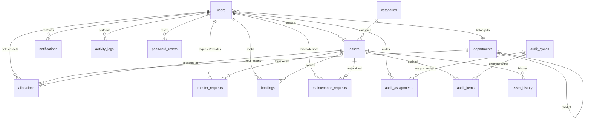

# AssetFlow — Data Dictionary

**Database Schema Reference**

---

## Table of Contents

- [Overview](#overview)
- [Schema Conventions](#schema-conventions)
- [users](#users)
- [departments](#departments)
- [categories](#categories)
- [assets](#assets)
- [asset_history](#asset_history)
- [allocations](#allocations)
- [transfer_requests](#transfer_requests)
- [bookings](#bookings)
- [maintenance_requests](#maintenance_requests)
- [audit_cycles](#audit_cycles)
- [audit_assignments](#audit_assignments)
- [audit_items](#audit_items)
- [notifications](#notifications)
- [activity_logs](#activity_logs)
- [password_resets](#password_resets)
- [Relationship Map](#relationship-map)

---

## Overview

AssetFlow uses a single SQLite database file (`server/assetflow.db`) with 15 tables. The schema is defined in `server/src/db.js` and created idempotently on server boot.

**Database configuration:**
```sql
PRAGMA journal_mode = WAL;    -- Write-Ahead Logging for concurrent reads
PRAGMA foreign_keys = ON;      -- Enforce referential integrity
```

**Table count:** 15 (14 from PRD §6 + `asset_history` for lifecycle timeline)

---

## Schema Conventions

| Convention | Rule |
|---|---|
| Primary keys | `INTEGER PRIMARY KEY AUTOINCREMENT` on every table |
| Foreign keys | Named `<entity>_id`, with `REFERENCES <table>(id)` |
| Timestamps | ISO 8601 text format (`YYYY-MM-DDTHH:mm:ss.000Z`), default `datetime('now')` |
| Booleans | `INTEGER DEFAULT 0` (0 = false, 1 = true) |
| Enums | `TEXT` with `CHECK()` constraints | 
| JSON columns | `TEXT` storing serialized JSON (parsed in application code) |
| Naming | `snake_case` for all column and table names |

---

## users

**Purpose:** All system users — admin, asset managers, department heads, and employees.

| Column | Type | Constraints | Description |
|---|---|---|---|
| `id` | INTEGER | PRIMARY KEY AUTOINCREMENT | Unique user identifier |
| `name` | TEXT | NOT NULL | Full name |
| `email` | TEXT | NOT NULL UNIQUE | Login email |
| `password_hash` | TEXT | NOT NULL | bcrypt hash (10 salt rounds) |
| `role` | TEXT | NOT NULL, CHECK (`admin`, `asset_manager`, `dept_head`, `employee`) | System role |
| `department_id` | INTEGER | REFERENCES departments(id) | Assigned department (nullable) |
| `status` | TEXT | DEFAULT `'active'`, CHECK (`active`, `inactive`) | Account status |
| `created_at` | TEXT | DEFAULT `datetime('now')` | Account creation timestamp |

**Business Rules:**
- Signup always creates `role = 'employee'`. Role changes are Admin-only via `PUT /api/users/:id`.
- Inactive users (`status = 'inactive'`) cannot log in (403 at middleware level).
- The `password_hash` column is never returned in API responses.
- The admin account uses `admin@assetflow.app` as the login email (not the organizational email).

**Example Record (Seed Data):**

| id | name | email | role | department_id | status |
|---|---|---|---|---|---|
| 1 | Arjun Mehta | admin@assetflow.app | admin | 1 | active |
| 2 | Deepak Nair | deepak.nair@nexgeninfra.com | asset_manager | 1 | active |
| 16 | Karthik Bhat | karthik.bhat@nexgeninfra.com | employee | 1 | inactive |

---

## departments

**Purpose:** Organizational departments with optional hierarchy.

| Column | Type | Constraints | Description |
|---|---|---|---|
| `id` | INTEGER | PRIMARY KEY AUTOINCREMENT | Unique department identifier |
| `name` | TEXT | NOT NULL UNIQUE | Department name |
| `head_user_id` | INTEGER | REFERENCES users(id) | Department head (nullable) |
| `parent_id` | INTEGER | REFERENCES departments(id) | Parent department for hierarchy (nullable) |
| `status` | TEXT | DEFAULT `'active'`, CHECK (`active`, `inactive`) | Department status |

**Business Rules:**
- `parent_id` creates a tree structure (e.g., Engineering → Platform Team, QA).
- Inactive departments remain in the database but are excluded from active operations.

**Example Records:**

| id | name | head_user_id | parent_id | status |
|---|---|---|---|---|
| 1 | Engineering | 4 | null | active |
| 5 | Platform Team | 8 | 1 | active |
| 7 | Design & Surveying | null | null | inactive |

---

## categories

**Purpose:** Asset categories with custom field definitions.

| Column | Type | Constraints | Description |
|---|---|---|---|
| `id` | INTEGER | PRIMARY KEY AUTOINCREMENT | Unique category identifier |
| `name` | TEXT | NOT NULL UNIQUE | Category name |
| `description` | TEXT | | Category description |
| `custom_fields` | TEXT | | JSON array of field definitions |

**Custom Fields Schema:**
```json
[
  { "name": "ram", "label": "RAM", "type": "text", "required": false },
  { "name": "storage", "label": "Storage", "type": "text", "required": false }
]
```

**Example Records:**

| id | name | description |
|---|---|---|
| 1 | Laptops & Notebooks | Portable computing devices |
| 4 | Conference Rooms & Meeting Pods | Bookable meeting spaces |
| 6 | Vehicles | Company-owned vehicles |

---

## assets

**Purpose:** All physical assets tracked by the system.

| Column | Type | Constraints | Description |
|---|---|---|---|
| `id` | INTEGER | PRIMARY KEY AUTOINCREMENT | Unique asset identifier |
| `tag` | TEXT | NOT NULL UNIQUE | Auto-generated tag (`AF-NNNN`) |
| `name` | TEXT | NOT NULL | Asset display name |
| `category_id` | INTEGER | REFERENCES categories(id) | Asset category |
| `serial_no` | TEXT | | Manufacturer serial number |
| `acquisition_date` | TEXT | | Purchase date |
| `acquisition_cost` | REAL | | Purchase price |
| `condition` | TEXT | CHECK (`New`, `Good`, `Fair`, `Poor`) | Physical condition |
| `location` | TEXT | | Physical location |
| `photo_url` | TEXT | | URL to uploaded photo |
| `is_bookable` | INTEGER | DEFAULT 0 | Whether asset is a shared/bookable resource |
| `status` | TEXT | NOT NULL DEFAULT `'Available'`, CHECK (7 states) | Lifecycle status |
| `custom_values` | TEXT | | JSON object with category-specific field values |
| `created_by` | INTEGER | REFERENCES users(id) | User who registered the asset |
| `created_at` | TEXT | DEFAULT `datetime('now')` | Registration timestamp |

**Valid Status Values:** `Available`, `Allocated`, `Reserved`, `Under Maintenance`, `Lost`, `Retired`, `Disposed`

**Business Rules:**
- Tags are auto-generated by `nextTag()` in `routes/assets.js`: increments from the highest existing `AF-NNNN` tag.
- `is_bookable = 1` assets appear in the booking interface.
- Status changes are enforced by `transitionAsset()` in `services/lifecycle.js`.
- `custom_values` stores JSON matching the field definitions in the asset's category.

**Example Records:**

| id | tag | name | status | is_bookable | location |
|---|---|---|---|---|---|
| 14 | AF-0014 | MacBook Pro 14" M3 | Allocated | 0 | Pune HQ — Floor 3 |
| 26 | AF-0026 | Agile Den (Room 301) | Available | 1 | Pune HQ — Floor 3 |
| 8 | AF-0008 | HP LaserJet Pro | Disposed | 0 | Pune HQ — Floor 1 |

---

## asset_history

**Purpose:** Lifecycle timeline for each asset. Every call to `transitionAsset()` writes a record here.

| Column | Type | Constraints | Description |
|---|---|---|---|
| `id` | INTEGER | PRIMARY KEY AUTOINCREMENT | Unique record identifier |
| `asset_id` | INTEGER | NOT NULL, REFERENCES assets(id) | Asset this history belongs to |
| `from_state` | TEXT | | Previous lifecycle state (null for initial registration) |
| `to_state` | TEXT | NOT NULL | New lifecycle state |
| `actor_id` | INTEGER | REFERENCES users(id) | User who triggered the transition |
| `detail` | TEXT | | Context description |
| `created_at` | TEXT | DEFAULT `datetime('now')` | Transition timestamp |

**Business Rules:**
- Append-only — records are never updated or deleted.
- `from_state = NULL` indicates the initial registration event.
- The `detail` field provides human-readable context for the transition.

**Example Records:**

| asset_id | from_state | to_state | detail |
|---|---|---|---|
| 14 | null | Available | Registered |
| 14 | Available | Allocated | Allocated to user |
| 14 | Allocated | Under Maintenance | Maintenance approved |

---

## allocations

**Purpose:** Asset allocation records — who holds what, and when.

| Column | Type | Constraints | Description |
|---|---|---|---|
| `id` | INTEGER | PRIMARY KEY AUTOINCREMENT | Unique allocation identifier |
| `asset_id` | INTEGER | NOT NULL, REFERENCES assets(id) | Allocated asset |
| `holder_user_id` | INTEGER | REFERENCES users(id) | Individual holder (nullable) |
| `holder_department_id` | INTEGER | REFERENCES departments(id) | Department holder (nullable) |
| `allocated_by` | INTEGER | NOT NULL, REFERENCES users(id) | User who performed the allocation |
| `allocated_at` | TEXT | DEFAULT `datetime('now')` | Allocation timestamp |
| `expected_return_date` | TEXT | | Expected return date (nullable) |
| `returned_at` | TEXT | | Actual return timestamp (nullable) |
| `return_condition_notes` | TEXT | | Notes on asset condition at return |
| `status` | TEXT | NOT NULL DEFAULT `'active'`, CHECK (`active`, `returned`) | Allocation status |

**Business Rules:**
- Exactly one of `holder_user_id` or `holder_department_id` is non-null per record.
- Only one active allocation per asset is permitted (enforced by `activeAllocation()` check).
- Overdue = `status = 'active'` AND `expected_return_date < now()`.
- Returns set `status = 'returned'` and populate `returned_at` and `return_condition_notes`.

**Example Records:**

| id | asset_id | holder_user_id | status | expected_return_date |
|---|---|---|---|---|
| 1 | 1 | 5 | active | 2026-07-01 |
| 19 | 19 | 15 | active | 2026-07-01 (overdue) |
| 3 | 3 | 7 | returned | null |

---

## transfer_requests

**Purpose:** Requests to transfer an allocated asset from one holder to another.

| Column | Type | Constraints | Description |
|---|---|---|---|
| `id` | INTEGER | PRIMARY KEY AUTOINCREMENT | Unique transfer identifier |
| `asset_id` | INTEGER | NOT NULL, REFERENCES assets(id) | Asset being transferred |
| `from_allocation_id` | INTEGER | NOT NULL, REFERENCES allocations(id) | Current active allocation |
| `requested_by` | INTEGER | NOT NULL, REFERENCES users(id) | User who initiated the transfer |
| `to_user_id` | INTEGER | REFERENCES users(id) | Target user (nullable) |
| `to_department_id` | INTEGER | REFERENCES departments(id) | Target department (nullable) |
| `status` | TEXT | NOT NULL DEFAULT `'requested'`, CHECK (`requested`, `approved`, `rejected`) | Transfer status |
| `decided_by` | INTEGER | REFERENCES users(id) | User who approved/rejected |
| `decided_at` | TEXT | | Decision timestamp |
| `created_at` | TEXT | DEFAULT `datetime('now')` | Request timestamp |

**Business Rules:**
- Transfers only apply to currently allocated assets. Attempting to transfer an unallocated asset returns 400.
- Approval runs inside a transaction: close old allocation → lifecycle transition (Allocated→Allocated) → create new allocation → update transfer status.
- Employees can only request transfers for assets they hold.

**Example Records:**

| id | asset_id | status | requested_by | to_user_id |
|---|---|---|---|---|
| 1 | 3 | approved | 5 | 7 |
| 4 | 13 | requested | 12 | 9 |

---

## bookings

**Purpose:** Time-slot reservations for bookable shared resources.

| Column | Type | Constraints | Description |
|---|---|---|---|
| `id` | INTEGER | PRIMARY KEY AUTOINCREMENT | Unique booking identifier |
| `asset_id` | INTEGER | NOT NULL, REFERENCES assets(id) | Bookable asset |
| `booked_by` | INTEGER | NOT NULL, REFERENCES users(id) | User who made the booking |
| `start_time` | TEXT | NOT NULL | Booking start (ISO 8601) |
| `end_time` | TEXT | NOT NULL | Booking end (ISO 8601) |
| `purpose` | TEXT | | Booking reason |
| `status` | TEXT | NOT NULL DEFAULT `'booked'`, CHECK (`booked`, `cancelled`) | Persisted status |
| `created_at` | TEXT | DEFAULT `datetime('now')` | Booking creation timestamp |

**Business Rules:**
- Only `booked` and `cancelled` are persisted. Display statuses (`Upcoming`, `Ongoing`, `Completed`) are derived at read time via time comparison.
- Overlap check: `newStart < existingEnd && newEnd > existingStart` — applied against all non-cancelled bookings for the same asset.
- Back-to-back bookings (A ends at 10:00, B starts at 10:00) pass the overlap check.
- Only assets with `is_bookable = 1` can be booked.

**Example Records:**

| id | asset_id | start_time | end_time | status |
|---|---|---|---|---|
| 4 | 26 | 2026-07-07T09:00:00.000Z | 2026-07-07T10:00:00.000Z | booked |
| 5 | 26 | 2026-07-07T10:00:00.000Z | 2026-07-07T11:00:00.000Z | booked |
| 8 | 26 | 2026-07-07T09:00:00.000Z | 2026-07-07T10:30:00.000Z | cancelled |

Bookings 4 and 5 are the **back-to-back boundary case** — they share a touching endpoint (10:00) and are both valid.

---

## maintenance_requests

**Purpose:** Maintenance workflow records from request through resolution.

| Column | Type | Constraints | Description |
|---|---|---|---|
| `id` | INTEGER | PRIMARY KEY AUTOINCREMENT | Unique request identifier |
| `asset_id` | INTEGER | NOT NULL, REFERENCES assets(id) | Asset requiring maintenance |
| `raised_by` | INTEGER | NOT NULL, REFERENCES users(id) | User who raised the request |
| `issue` | TEXT | NOT NULL | Problem description |
| `priority` | TEXT | DEFAULT `'Medium'`, CHECK (`Low`, `Medium`, `High`) | Request priority |
| `photo_url` | TEXT | | Photo of the issue |
| `status` | TEXT | NOT NULL DEFAULT `'pending'`, CHECK (6 values) | Workflow status |
| `technician_name` | TEXT | | Assigned technician name (free text) |
| `technician_contact` | TEXT | | Technician contact info |
| `decided_by` | INTEGER | REFERENCES users(id) | Manager who approved/rejected |
| `resolved_at` | TEXT | | Resolution timestamp |
| `created_at` | TEXT | DEFAULT `datetime('now')` | Request creation timestamp |

**Valid Status Values:** `pending`, `approved`, `rejected`, `assigned`, `in_progress`, `resolved`

**Asset Status Side-Effects:**

| Action | Asset Status Change |
|---|---|
| `approve` | Current → **Under Maintenance** |
| `resolve` | Under Maintenance → **Available** |
| All others | No change |

**Example Records:**

| id | asset_id | issue | priority | status |
|---|---|---|---|---|
| 1 | 14 | Keyboard unresponsive keys | High | resolved |
| 6 | 5 | Occasionally loses Wi-Fi | Low | pending |

---

## audit_cycles

**Purpose:** Audit cycle definitions with scope, date range, and status.

| Column | Type | Constraints | Description |
|---|---|---|---|
| `id` | INTEGER | PRIMARY KEY AUTOINCREMENT | Unique cycle identifier |
| `name` | TEXT | NOT NULL | Cycle name |
| `scope_department_id` | INTEGER | REFERENCES departments(id) | Department scope filter (nullable) |
| `scope_location` | TEXT | | Location scope filter (nullable) |
| `start_date` | TEXT | | Audit period start |
| `end_date` | TEXT | | Audit period end |
| `status` | TEXT | NOT NULL DEFAULT `'open'`, CHECK (`open`, `closed`) | Cycle status |
| `created_by` | INTEGER | NOT NULL, REFERENCES users(id) | Admin who created the cycle |
| `created_at` | TEXT | DEFAULT `datetime('now')` | Creation timestamp |

**Business Rules:**
- Only Admins can create and close audit cycles.
- Closing a cycle locks it — no further item modifications allowed.
- Close-cycle side-effects: Missing → Lost, Damaged → auto-raise maintenance.

---

## audit_assignments

**Purpose:** Maps auditors to audit cycles.

| Column | Type | Constraints | Description |
|---|---|---|---|
| `id` | INTEGER | PRIMARY KEY AUTOINCREMENT | Unique assignment identifier |
| `cycle_id` | INTEGER | NOT NULL, REFERENCES audit_cycles(id) | Parent audit cycle |
| `auditor_user_id` | INTEGER | NOT NULL, REFERENCES users(id) | Assigned auditor |

---

## audit_items

**Purpose:** Individual asset records within an audit cycle.

| Column | Type | Constraints | Description |
|---|---|---|---|
| `id` | INTEGER | PRIMARY KEY AUTOINCREMENT | Unique item identifier |
| `cycle_id` | INTEGER | NOT NULL, REFERENCES audit_cycles(id) | Parent audit cycle |
| `asset_id` | INTEGER | NOT NULL, REFERENCES assets(id) | Asset being audited |
| `result` | TEXT | DEFAULT `'pending'`, CHECK (`pending`, `verified`, `missing`, `damaged`) | Audit finding |
| `note` | TEXT | | Auditor's notes |
| `checked_by` | INTEGER | REFERENCES users(id) | User who marked the result |
| `checked_at` | TEXT | | Mark timestamp |

---

## notifications

**Purpose:** In-app notifications dispatched by the `notify()` service function.

| Column | Type | Constraints | Description |
|---|---|---|---|
| `id` | INTEGER | PRIMARY KEY AUTOINCREMENT | Unique notification identifier |
| `user_id` | INTEGER | NOT NULL, REFERENCES users(id) | Recipient user |
| `type` | TEXT | NOT NULL | Notification type identifier |
| `title` | TEXT | NOT NULL | Display title |
| `body` | TEXT | | Notification message body |
| `entity_ref` | TEXT | | Reference key for deduplication (e.g., `asset:14`, `booking:5`) |
| `is_read` | INTEGER | DEFAULT 0 | Read flag (0 = unread, 1 = read) |
| `created_at` | TEXT | DEFAULT `datetime('now')` | Dispatch timestamp |

**Business Rules:**
- Delivery is in-app only (no email/SMS — PRD §7).
- `entity_ref` is used as an idempotency key for overdue alerts and booking reminders.
- Users can only see their own notifications.

---

## activity_logs

**Purpose:** System-wide audit trail of every significant action.

| Column | Type | Constraints | Description |
|---|---|---|---|
| `id` | INTEGER | PRIMARY KEY AUTOINCREMENT | Unique log entry identifier |
| `user_id` | INTEGER | NOT NULL, REFERENCES users(id) | Actor who performed the action |
| `action` | TEXT | NOT NULL | Action identifier (create, update, transition, etc.) |
| `entity_type` | TEXT | NOT NULL | Type of affected entity (asset, user, booking, etc.) |
| `entity_id` | INTEGER | | ID of affected entity |
| `detail` | TEXT | | JSON context (additional metadata) |
| `created_at` | TEXT | DEFAULT `datetime('now')` | Action timestamp |

**Business Rules:**
- Append-only — records are never updated or deleted.
- Accessible to Admin, Asset Manager, and Dept Head roles.
- Limited to 500 rows per query (server-side `LIMIT`).
- Queryable by user, entityType, and date range.

---

## password_resets

**Purpose:** Token-based password reset flow.

| Column | Type | Constraints | Description |
|---|---|---|---|
| `id` | INTEGER | PRIMARY KEY AUTOINCREMENT | Unique record identifier |
| `user_id` | INTEGER | NOT NULL, REFERENCES users(id) | User requesting the reset |
| `token` | TEXT | NOT NULL | 48-character hex token (`crypto.randomBytes(24)`) |
| `expires_at` | TEXT | NOT NULL | Token expiry (1 hour from creation) |
| `used` | INTEGER | DEFAULT 0 | Single-use flag (0 = unused, 1 = used) |

**Business Rules:**
- Tokens expire after 1 hour.
- Tokens can only be used once (`used` flag prevents reuse).
- The API always returns 200 for forgot-password requests to prevent email enumeration.

---

## Relationship Map



**Key relationships:**
- `users` → `departments`: Many-to-one (a user belongs to one department)
- `departments` → `departments`: Self-referential (parent-child hierarchy)
- `assets` → `categories`: Many-to-one (an asset has one category)
- `allocations` → `assets`: Many-to-one (an asset can have many allocations over time, but at most one active)
- `transfer_requests` → `allocations`: Many-to-one (a transfer references the current active allocation)
- `audit_items` → `audit_cycles` + `assets`: Junction table linking cycles to assets

---

### Design Notes

**DN-DD-01:** The `asset_history` table is not defined in PRD §6 but is present in the schema. It was introduced to support the lifecycle timeline view on the asset detail page. See `ARCHITECTURE.md` DN-ARCH-01.

**DN-DD-02:** The `password_resets.used` column is an implementation addition beyond PRD §6. It prevents token reuse, which is standard security practice for password reset flows.

**DN-DD-03:** All timestamp columns use `TEXT` type with ISO 8601 format strings. SQLite's `datetime()` function parses these correctly for comparison operations. This is more portable than using `INTEGER` epoch timestamps.
