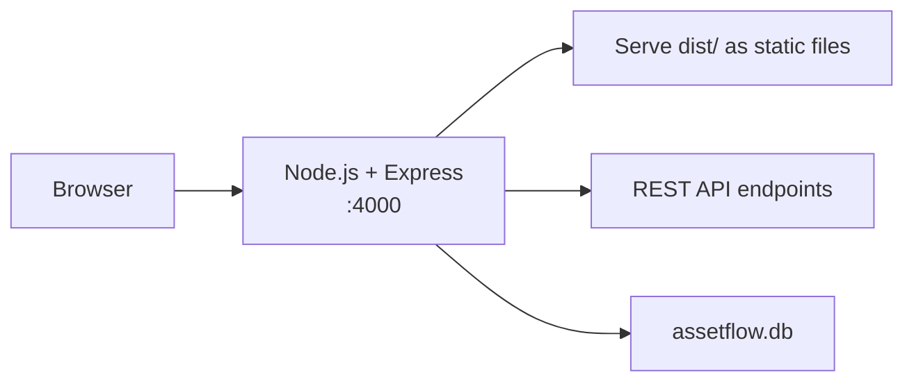
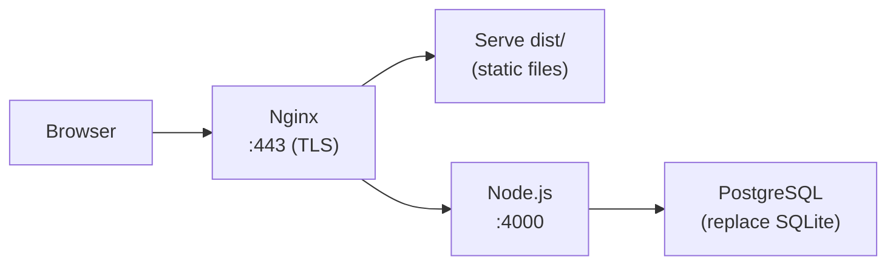

# AssetFlow — Deployment Guide

**Setup, Build & Deployment Instructions**

---

## Table of Contents

- [Prerequisites](#prerequisites)
- [Local Development Setup](#local-development-setup)
- [Environment Variables](#environment-variables)
- [Database Initialization](#database-initialization)
- [Seed Process](#seed-process)
- [Build Process](#build-process)
- [Production Deployment](#production-deployment)
- [Common Errors](#common-errors)
- [Troubleshooting](#troubleshooting)
- [Backup Strategy](#backup-strategy)
- [Deployment Checklist](#deployment-checklist)

---

## Prerequisites

| Requirement | Version | Purpose |
|---|---|---|
| **Node.js** | ≥ 18.x | Runtime for backend and frontend build tooling |
| **npm** | ≥ 9.x | Package management |
| **Git** | Any recent | Clone the repository |
| **Disk space** | ~200 MB | Dependencies + SQLite database |

No external database server, Docker, Redis, or cloud services are required. SQLite is embedded via the `better-sqlite3` npm package and compiles native bindings during `npm install`.

---

## Local Development Setup

### Step 1: Clone the Repository

```bash
git clone https://github.com/pranavpanchal1326/AssetFlow.git
cd AssetFlow
```

### Step 2: Install & Start the Backend

```bash
cd server
npm install
npm run seed    # Creates assetflow.db with demo data
npm run dev     # Starts API on http://localhost:4000
```

Expected output:
```
🌱 AssetFlow SQLite Seeder
==========================

Clearing existing data...
  ✓ All tables cleared.

Creating admin account...
  ✓ Admin: admin@assetflow.app / Admin@123

Seeding departments...
  ✓ 7 departments seeded.
...
🎉 Seed complete successfully!

AssetFlow API listening on http://localhost:4000
```

### Step 3: Install & Start the Frontend

```bash
# In a new terminal, from the project root
npm install
npm run dev     # Starts Vite dev server on http://localhost:5173
```

### Step 4: Verify

1. Open `http://localhost:5173` in your browser.
2. Click **Enter App**, then **Sign In**.
3. Login as Admin: `admin@assetflow.app` / `Admin@123`.
4. Dashboard should show KPI cards with seeded data.

---

## Environment Variables

### Backend (`server/.env`)

Copy `server/.env.example` to `server/.env`:

```bash
cp server/.env.example server/.env
```

| Variable | Default | Description |
|---|---|---|
| `JWT_SECRET` | Dev fallback (with warning) | Secret for signing JWT tokens. **Required in production.** Generate with: `node -e "console.log(require('crypto').randomBytes(48).toString('hex'))"` |
| `PORT` | `4000` | Express server port |
| `DB_PATH` | `./data.sqlite` | SQLite database file path (relative to `server/` or absolute) |
| `NODE_ENV` | `development` | `development` or `production` |

> [!IMPORTANT]
> In production, `JWT_SECRET` must be set to a strong random string. The server uses a dev-only fallback and logs a console warning if the variable is missing.

### Frontend (`.env`)

Copy `.env.example` to `.env` at the project root:

```bash
cp .env.example .env
```

| Variable | Default | Description |
|---|---|---|
| `VITE_API_URL` | Not set (uses proxy) | Set only if the backend runs on a different host/port. When unset, the Vite dev server proxies `/api` and `/uploads` to `http://localhost:4000` |

**Recommended for local development:** Leave `VITE_API_URL` unset and use the Vite proxy.

---

## Database Initialization

The SQLite database is created automatically when the backend starts. The schema is defined in `server/src/db.js` and runs idempotently on boot.

### Schema Details

- **15 tables** created with `CREATE TABLE IF NOT EXISTS`
- **WAL mode** enabled: `PRAGMA journal_mode = WAL`
- **Foreign keys** enforced: `PRAGMA foreign_keys = ON`
- **CHECK constraints** on all enum columns (role, status, condition, priority, result)

### Manual Database Access

If you need to inspect the database directly:

```bash
# Using the sqlite3 CLI (if installed)
sqlite3 server/assetflow.db

# Common queries
.tables
SELECT COUNT(*) FROM assets;
SELECT tag, name, status FROM assets LIMIT 5;
.quit
```

---

## Seed Process

### Running the Seed Script

```bash
cd server
npm run seed
```

This executes `server/src/seed.js`, which:

1. Disables FK constraints temporarily (`PRAGMA foreign_keys = OFF`)
2. Clears all 14 data tables (preserves schema)
3. Creates the admin account (`admin@assetflow.app` / `Admin@123`)
4. Loads and inserts all records from `data/*.json`:
   - 7 departments, 7 categories, 18 users
   - 35 assets, 32 allocations, 4 transfers
   - 14 bookings, 7 maintenance requests
   - 2 audit cycles, 4 assignments, 21 audit items
   - 27 notifications, 69 activity logs
5. Re-enables FK constraints (`PRAGMA foreign_keys = ON`)

### Idempotency

The seed script is fully idempotent — safe to run repeatedly. Each run deletes all existing data and re-inserts from the JSON files.

### Seed Data Source

All seed data files are in the `data/` directory:

| File | Records |
|---|---|
| `departments.json` | 7 |
| `categories.json` | 7 |
| `employees.json` | 18 (includes admin) |
| `assets.json` | 35 |
| `allocations.json` | 32 |
| `transfers.json` | 4 |
| `bookings.json` | 14 |
| `maintenance.json` | 7 |
| `audit_cycles.json` | 2 |
| `audit_assignments.json` | 4 |
| `audit_items.json` | 21 |
| `notifications.json` | 27 |
| `activity_logs.json` | 69 |

---

## Build Process

### Frontend Production Build

```bash
# From project root
npm run build
```

This runs `vite build` and outputs optimized static files to `dist/`:

```
dist/
├── index.html
├── assets/
│   ├── index-[hash].js
│   └── index-[hash].css
```

### Backend

The backend does not require a build step. It runs directly with Node.js:

```bash
cd server
node src/index.js
```

Or with nodemon for development:

```bash
cd server
npm run dev     # Uses nodemon for auto-restart
```

---

## Production Deployment

### Option A: Single Server (Recommended for Demo)



1. Build the frontend: `npm run build`
2. Configure Express to serve the `dist/` directory:
   ```javascript
   app.use(express.static(path.join(__dirname, '..', '..', 'dist')));
   // SPA fallback — serve index.html for non-API routes
   app.get('*', (req, res) => {
     res.sendFile(path.join(__dirname, '..', '..', 'dist', 'index.html'));
   });
   ```
3. Set environment variables:
   ```bash
   export JWT_SECRET=$(node -e "console.log(require('crypto').randomBytes(48).toString('hex'))")
   export NODE_ENV=production
   export PORT=4000
   ```
4. Start with PM2:
   ```bash
   pm2 start server/src/index.js --name assetflow
   ```

### Option B: Nginx + Node.js (Production-Grade)



1. Build the frontend and place `dist/` in a web-root.
2. Configure Nginx:
   ```nginx
   server {
       listen 443 ssl;
       server_name assetflow.example.com;

       # TLS certificates
       ssl_certificate     /etc/ssl/certs/assetflow.crt;
       ssl_certificate_key /etc/ssl/private/assetflow.key;

       # Serve static frontend
       root /var/www/assetflow/dist;
       index index.html;

       # SPA fallback
       location / {
           try_files $uri $uri/ /index.html;
       }

       # Proxy API requests to Express
       location /api {
           proxy_pass http://127.0.0.1:4000;
           proxy_set_header Host $host;
           proxy_set_header X-Real-IP $remote_addr;
       }

       # Proxy upload serving
       location /uploads {
           proxy_pass http://127.0.0.1:4000;
       }
   }
   ```
3. Run Express with PM2 in cluster mode:
   ```bash
   pm2 start server/src/index.js -i max --name assetflow-api
   ```

---

## Common Errors

| Error | Cause | Solution |
|---|---|---|
| `Cannot find module 'better-sqlite3'` | Native module not compiled | Run `npm install` again in `server/` |
| `SQLITE_CONSTRAINT: FOREIGN KEY constraint failed` | FK violation during seed | Ensure `PRAGMA foreign_keys = OFF` runs before seed (the script handles this) |
| `Error: listen EADDRINUSE :::4000` | Port already in use | Kill the existing process: `npx kill-port 4000` |
| `Cannot reach the AssetFlow server` | Frontend can't reach backend | Ensure backend is running on port 4000 |
| `SyntaxError: Unexpected token` in seed | Malformed JSON in data files | Validate the JSON file: `node -e "JSON.parse(require('fs').readFileSync('data/file.json'))"` |
| `Error: ENOENT: no such file or directory, open '...assetflow.db'` | Database file doesn't exist | Run `npm run seed` or start the server (schema auto-creates) |
| `MulterError: File too large` | Upload exceeds 8MB limit | Reduce file size before uploading |
| `better-sqlite3 build failed` | Missing C++ build tools | Install build tools: `npm install -g node-gyp` (Windows: install windows-build-tools) |

---

## Troubleshooting

### Backend Won't Start

1. Check Node.js version: `node --version` (must be ≥ 18)
2. Delete `node_modules` and reinstall: `rm -rf node_modules && npm install`
3. Check if port 4000 is in use: `lsof -i :4000` (macOS/Linux) or `netstat -ano | findstr :4000` (Windows)

### Frontend Won't Start

1. Check if `node_modules` exists at project root: `ls node_modules`
2. Reinstall: `rm -rf node_modules && npm install`
3. Check if port 5173 is available

### Database Issues

1. Delete the database and re-seed:
   ```bash
   rm server/assetflow.db server/assetflow.db-wal server/assetflow.db-shm
   cd server && npm run seed
   ```
2. Verify table existence:
   ```bash
   sqlite3 server/assetflow.db ".tables"
   ```

### Login Not Working After Seed

The seed script creates user passwords using bcrypt. If you see login failures after seeding:

1. Verify the admin exists: `sqlite3 server/assetflow.db "SELECT email, role FROM users WHERE id = 1"`
2. Expected: `admin@assetflow.app|admin`
3. If wrong, re-run `npm run seed`

---

## Backup Strategy

### Database Backup

The SQLite database is a single file. Backup is a file copy:

```bash
# Stop the server first (or use WAL checkpoint)
cp server/assetflow.db server/assetflow.db.backup-$(date +%Y%m%d)
```

For a hot backup (while server is running):

```bash
sqlite3 server/assetflow.db ".backup 'server/assetflow.db.backup'"
```

### Seed Data Backup

The `data/*.json` files are the authoritative source for demo data. They are version-controlled in Git. To recreate the demo database from scratch:

```bash
rm server/assetflow.db
cd server && npm run seed
```

### Upload Files

Uploaded photos/documents are stored in `server/uploads/`. This directory is gitignored. For a full backup:

```bash
tar -czf uploads-backup.tar.gz server/uploads/
```

---

## Deployment Checklist

### Pre-Deployment

- [ ] `npm install` in `server/` succeeds without errors
- [ ] `npm install` at project root succeeds without errors
- [ ] `npm run seed` completes: `🎉 Seed complete successfully!`
- [ ] Backend starts: `AssetFlow API listening on http://localhost:4000`
- [ ] Frontend starts: Vite dev server on port 5173
- [ ] Health check: `curl http://localhost:4000/api/health` returns `{"ok":true}`
- [ ] Login works: `admin@assetflow.app` / `Admin@123`

### Post-Deployment Verification

- [ ] Dashboard shows 6 KPI cards with correct counts
- [ ] Asset Directory lists 35 assets
- [ ] 2 overdue returns visible (AF-0019, AF-0017)
- [ ] All 4 roles can log in with seeded credentials
- [ ] Allocation conflict (409) works on already-held asset
- [ ] Booking overlap (409) works on conflicting time slot
- [ ] CSV export downloads valid file
- [ ] Notifications bell shows correct unread count

### Production Hardening (Post-Hackathon)

- [ ] Set `JWT_SECRET` to a strong random value
- [ ] Set `NODE_ENV=production`
- [ ] Enable TLS (HTTPS) via reverse proxy
- [ ] Add rate limiting (express-rate-limit)
- [ ] Add security headers (helmet)
- [ ] Externalize file uploads to object storage
- [ ] Migrate from SQLite to PostgreSQL
- [ ] Set up automated database backups
- [ ] Configure log aggregation

---

### Design Notes

**DN-DEP-01:** The project has two separate `node_modules` directories — one at the project root (frontend: React, Vite) and one in `server/` (backend: Express, better-sqlite3). Both must be installed separately.

**DN-DEP-02:** The `server/.env.example` shows `DB_PATH=./data.sqlite`, but the actual default in `db.js` resolves to `server/assetflow.db` when no env var is set. The seed script creates the database at whatever path `db.js` resolves.

**DN-DEP-03:** The `better-sqlite3` package requires C++ build tools for native compilation. On Windows, this may require installing the Visual C++ Build Tools. On macOS, Xcode Command Line Tools are typically sufficient. On Linux, `build-essential` provides the necessary toolchain.
