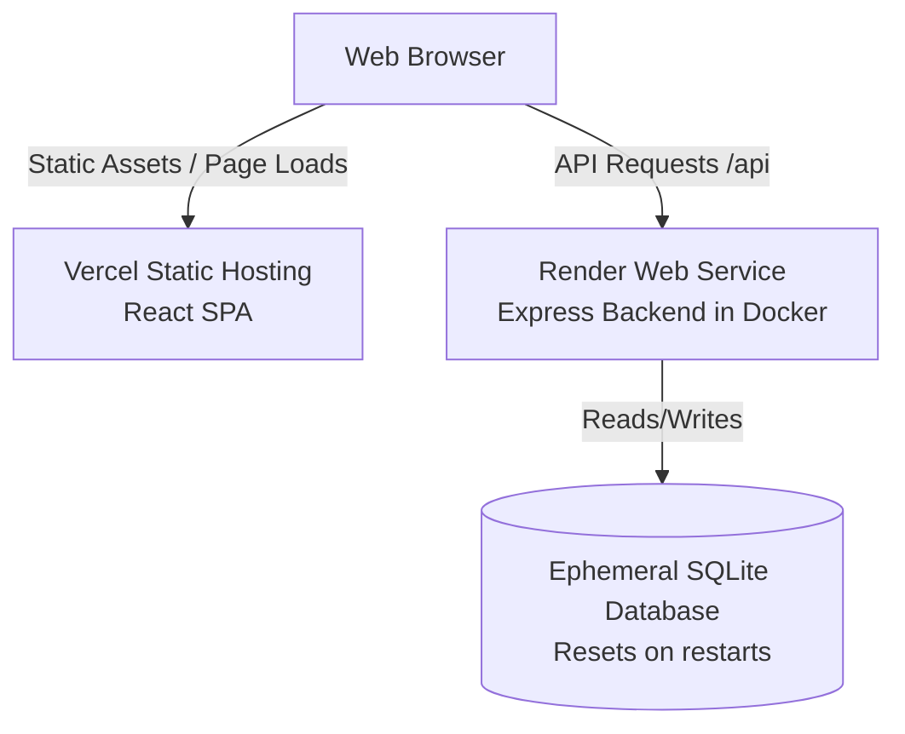

# AssetFlow — Free Tier Cloud Deployment Guide (Render & Vercel)

This guide provides step-by-step instructions to deploy the AssetFlow application to the cloud for **100% free** using **Vercel** for the React frontend and **Render** for the Express backend.

---

## Architecture Overview

---

## Step 1: Deploy the Backend to Render

Render provides a completely free tier for hosting Node/Docker web services.

### 1.1 Create a Web Service on Render
1. Log in to the [Render Dashboard](https://dashboard.render.com/).
2. Click **New** > **Web Service**.
3. Connect your GitHub repository `pranavpanchal1326/AssetFlow`.
4. In the creation form, configure the following settings:
   * **Name**: `assetflow-backend` (or a name of your choice)
   * **Language**: Select **Docker** (Render will automatically detect and build from `server/Dockerfile`).
   * **Root Directory**: `server` (Important: this tells Render to look in the `server` folder).
   * **Instance Type**: **Free**
5. Click **Advanced** and add the following **Environment Variables**:
   * `JWT_SECRET`: (Generate a random string or use `change-me-to-a-long-random-string`)
   * `NODE_ENV`: `production`
6. Click **Create Web Service**.

Render will now build the Docker image and deploy it. Once finished, Render will display your backend's public URL at the top of the page (e.g., `https://assetflow-backend.onrender.com`).

---

## Step 2: Deploy the Frontend to Vercel

Since your Vercel CLI is already logged in, we can deploy the frontend directly or you can link it in the Vercel dashboard.

### 2.1 Option A: Let me deploy it for you (Recommended)
Once your Render backend is deployed:
1. Copy the backend URL (e.g., `https://assetflow-backend.onrender.com`).
2. Paste it in the chat here.
3. I will run the Vercel deployment command for you with `VITE_API_URL` set to `<YOUR_BACKEND_URL>/api`.

### 2.2 Option B: Deploy via Vercel Dashboard
1. Go to the [Vercel Dashboard](https://vercel.com) and click **Add New** > **Project**.
2. Import your `AssetFlow` GitHub repository.
3. Keep the framework preset as **Vite** and root directory as `./`.
4. Add the environment variable:
   * **Name**: `VITE_API_URL`
   * **Value**: `https://your-backend-app.onrender.com/api` (make sure to append `/api` to your Render URL).
5. Click **Deploy**.
